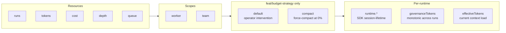

# 01 — Current state analysis

**Review:** Budget strategies redesign
**Date:** 2026-09-28 (initial); SDK 0.99.1 alignment pass 2026-09-29
**Baseline:** `feat/budget-strategy` at `9f950fb`

> **2026-09-29 note (SDK 0.99.1 alignment).** This synthesis was written against `feat/budget-strategy` at `9f950fb` and the SDK behavior the refactor plan was designed against. The SDK surface has since been validated against the project devDep pin `@earendil-works/pi-coding-agent@0.99.1` (commit ea9c54a on `refactor/budget`).
>
> **What changed in 0.99.1 vs the version the review was written against:**
> - `UsageEntry` and `SessionManager.appendUsage(...)` are real in 0.99.1 (they weren't available in the 0.80.x line). §4's "**`UsageEntry` for worker-attributed spend. Currently violated.**" critique is therefore now *forward-implementable as written*: the prescription matches the SDK shape exactly.
> - `getSessionStats()` was rewritten in 0.99.1 to iterate `getEntries()` (not `getBranch()`) and explicitly accumulate `UsageEntry` records. See `raw-evidence/pi-sdk-session-api.md` §0 and §2.2 for the diff and its implications. Bug 3's "post-overwrite mystery" analysis in §2/§6 still holds — the implementation details changed, the race class didn't.
> - `createAgentSession`'s `modelRegistry` option was replaced with `modelRuntime`. The two pi-hive call sites in `src/engine/dispatch.ts` and `src/engine/distiller.ts` were updated to omit the option (the SDK builds a default `ModelRuntime` from the same paths the extension consults).
>
> **What did NOT change:** every Issue 1–9 in this synthesis, the pi-docs alignment audit (§4), the bug timeline (§3), and the refactor plan's structural prescription all stand. The 0.99.1 alignment makes the prescription directly implementable; it does not change the diagnosis.
>
> **What was overtaken by later work** (for the reader's awareness): `origin/fix/fresh-rebuild` (post-dates this synthesis) shipped a v2 `BudgetLedger` refactor that supersedes much of the work proposed here. The structural critique below is still valid as input to understanding the v2 design's motivation, but readers should check `origin/fix/fresh-rebuild` for the actual implementation choice.

This is the synthesis. It draws on the evidence in `current-flow/` (delegation, budget-check, accumulation, fresh-true-bug-timeline), `raw-evidence/` (code line ranges, test coverage, bug history), and the research files in `pi-docs/` and `skills-review/`.

## Summary in one paragraph

The pi-hive budget layer enforces five resources (`runs`, `tokens`, `cost`, `depth`, `queue`) across two scopes (`worker`, `team`) using three independent counters per agent (`runtime.*` SDK-reported, `governanceTokens`/`governanceCostUsd` frozen-at-run-end, `effectiveTokens` current-context-load), with two strategies (`default` and `compact`) plus three operator intervention commands. The complexity is concentrated in the dual/triple counter system, which has three write sites (per-message `message_end`, per-run `agent_end`, per-compaction `compaction_end`) and three read sites (`checkDispatchBudgets` pre-flight, `workerConsumedTokens` mid-run, `budgetRemaining` display). The `fresh=true` respawn path depends on all three counters being correctly reset BEFORE the pre-flight check, AND on the end-of-run accumulation correctly not overwriting the fresh session's usage with stale pre-overwrite values. Bug 1 (reset order) and Bug 2 (mid-run check) were fixed; Bug 3 (the post-overwrite mystery) is unresolved. The `feat/budget-strategy` branch ships a new `summarize_progress` tool and three operator commands layered on top of this foundation. Per the pi-docs audit, the foundation aligns with documented patterns in places (custom tools, throw to refuse, register-then-activate tools) and conflicts with them in others (state in closure rather than `CustomEntry`, no `ctx.signal` propagation in handler paths, dual counters that conflict with branch-aware totals).

## 1. The five-resource × two-scope × three-strategy matrix

Five resources × two scopes × two strategies × three counters = 60 cells. Each cell has its own write site, its own read site, its own tests. The combinatorial surface is the structural source of bugs.

## 2. Structural issues (priority order)

### Issue 1 — Dual counter system, three write sites

**Severity: critical.** The three counters (`runtime.*`, `governanceTokens`, `effectiveTokens`) are mutually inconsistent at different lifecycle moments. The `??` fallthrough in `workerConsumedTokens` (`src/engine/governance.ts:34-58`) papers over the inconsistency but encodes a state machine in source code that is hard to test exhaustively.

**Evidence:** see `current-flow/accumulation-flow.md` for the per-event write sites.

**Pi-docs alignment:** `extensions.md#state-management` prescribes a four-tier model (tool-result `details`, `pi.appendEntry()`, `pi.sendMessage()`, external). The current implementation uses none of these — counters live in `HiveState.runtimes: Map<string, AgentRuntime>`, which is a closure-shaped mutable map that dies on `/reload`. The pi-docs-prescribed place for cumulative counters is `CustomEntry` (see `pi-docs/extension-patterns-reference.md#9-session-lifecycle-integration`).

**Bug class:** every counter-renaming, counter-resetting, or counter-source-changing refactor reintroduces the third-mystery bug class.

### Issue 2 — `getSessionStats()` overwrite happens BETWEEN live updates and end-of-run accumulation

**Severity: high.** The mid-run live values in `runtime.*` (incremented per `message_end`) are overwritten by `session.getSessionStats()` at the end of each run. The end-of-run `governanceTokens += delta` math then uses the overwritten values. If the SDK's stats return different values than the live accumulation (whether due to an aborted session, a missed message_end, or a stats-side bug), the delta is wrong.

**Evidence:** see `current-flow/accumulation-flow.md#what-happens-on-mid-run-abort` and `current-flow/fresh-true-bug-timeline.md#bug-3-third-mystery`.

**Tests pin the deterministic paths** (`tests/dispatch-usage.test.ts:385, 489, 544`) but do not exercise the abort-then-stats race.

**Pi-docs alignment:** none. Pi doesn't document `getSessionStats()` semantics — see `pi-docs/extension-patterns-reference.md#patterns-that-are-ambiguous-or-under-specified-in-pi-docs`.

### Issue 3 — The `fresh=true` semantics is overloaded

**Severity: high.** `fresh=true` currently means: (a) reload config from disk, (b) archive prior session, (c) zero all counters, (d) start a new Pi session. These four operations are coupled by a single flag and a single code block in `dispatch.ts:213-214`. The coupling is what made Bug 1 possible: a future refactor that splits (a) from (c) (e.g., "reload but keep counters" as a new mode) re-introduces the original ordering bug.

**Evidence:** see `current-flow/delegation-flow.md#2-reloadagentconfig-lines-213-214-only-if-fresh` and the `freshResetRuntime` comment at `src/engine/dispatch.ts:80-110`.

**Pi-docs alignment:** Pi documents the `tool_call` blocking primitive as the right place to gate expensive operations (`extensions.md#work-with-events`). The current `fresh=true` flag conflates "block and re-do" with "reset budget" — these are separate Pi-level concerns (a block is `tool_call`-event-shaped; a reset is session-state-shaped).

### Issue 4 — Operator intervention is wired before the dashboard UI exists

**Severity: medium.** The three dispatch commands (`endWorkerSession`, `compactWorkerSession`, `respawnWorkerSession`) are in `src/engine/dispatch.ts:929-1099` and fully tested in `tests/budget-strategy.test.ts`. The dashboard UI to invoke them is "out of scope for PR #54" per `raw-evidence/budget-strategy-plan.md`. The engine commands are correct in isolation but unusable from the UI surface that the user actually interacts with.

**Evidence:** see `current-flow/budget-check-flow.md#4-operator-intervention-three-dispatch-commands` and the plan's "Dashboard intervention UI (out of scope for PR #54)" note.

**Pi-docs alignment:** `extensions.md#custom-ui` recommends TUI widgets via `setWidget` (RPC-friendly) and `custom()` (TUI-only). The current engine code is mode-independent (correct), but the UI surface is missing.

### Issue 5 — Strategy code is layered on top of the budget foundation without isolation

**Severity: medium.** `src/engine/budget-strategy.ts` is 200 LOC, all new in `feat/budget-strategy`. It depends on `src/engine/governance.ts` (175 LOC) and `src/engine/dispatch.ts` (1101 LOC). The strategy decision (default vs compact) and the prompt-hint construction are mixed: `emitBudgetWarning` does the event emission, the strategy resolution, the prompt mutation, and the dedup — four concerns in one function.

**Evidence:** `src/engine/budget-strategy.ts:91-117` for `emitBudgetWarning`.

**Pi-docs alignment:** `extensions.md#work-with-events` notes that `message_end` "can replace a finalized message while preserving its role." A strategy that wants to inform the worker of an approaching budget should hook `before_agent_start` (per the pi-docs reference, §5 "Use `sendMessage` (CustomMessage) — Pi converts it to a user message") not mutate `runtime.systemPrompt` directly.

### Issue 6 — Test coverage is strong on the deterministic paths, weak on the races

**Severity: medium.** `tests/budget-strategy.test.ts` (667 LOC, 38 tests from `feat/budget-strategy`) pins every layer of the strategy feature in isolation. `tests/governance.test.ts` (167 LOC, 9 tests) pins the budget math. `tests/dispatch-usage.test.ts` (835 LOC) includes the Bug 1 regression (line 385), the W1.1 fresh-delta test (line 489), and the R3-1.1 mode-switch survival test (line 544).

**But:** no test exercises the abort-mid-run-then-`getSessionStats()` race. The tests use deterministic fake `createSession` factories; they do not exercise a real `runController.abort()` followed by a real SDK response.

**Evidence:** see `raw-evidence/test-coverage-analysis.md` (forthcoming).

**Pi-docs alignment:** none.

### Issue 7 — The `fresh=true` code path lives in dispatch.ts, not in the budget module

**Severity: low.** `freshResetRuntime` is exported from `src/engine/dispatch.ts` (line 73) and called from `dispatchAgent` at line 214. It would be more cohesive to live in `src/engine/governance.ts` (or a new `src/engine/budget-ledger.ts` module) since its job is "reset the budget counters", not "orchestrate a dispatch".

**Evidence:** `src/engine/dispatch.ts:73-110` for the function; `src/engine/dispatch.ts:214` for the call site.

**Pi-docs alignment:** `extensions.md#choose-where-it-loads` doesn't dictate file location but does recommend single-responsibility modules. The current placement splits "budget ledger" between `governance.ts`, `budget-strategy.ts`, and `dispatch.ts` — three files for one concern.

### Issue 8 — Final-message accumulation uses `agent_end` instead of `agent_settled`

**Severity: low (latent).** The current `agent_end` handler at `src/engine/dispatch.ts:707-714` runs final-message text accumulation. Per `sdk.md#subscribing-to-events`, `agent_end` "marks the end of one low-level agent run, but automatic recovery or queued work can still follow." The cleaner event for "Pi will not continue automatically" is `agent_settled`. The current `dispatchAgent` finalization runs after `session.prompt()` resolves, which is close to `agent_settled` but not identical — a recovery cycle (queued follow-up after an error, automatic retry after a transient API error) could fire another `agent_end` between the two, and the budget layer's accounting would split across them.

**Evidence:** `src/engine/dispatch.ts:707-714` (handler); `src/engine/dispatch.ts:727-758` (the `session.prompt()` resolution point where the current finalization runs).

**Pi-docs alignment:** `sdk.md#subscribing-to-events` calls `agent_settled` out as the canonical "Pi will not continue automatically" event. This is a follow-up, not a blocker; the current `session.prompt()`-after-resolution finalization is functionally close to `agent_settled` for non-recovery runs. Worth tracking because it's the right hook for a future bug class around budget accounting across multiple `agent_end` cycles.

### Issue 9 — `session.dispose()` is never called on the old runtime during respawn

**Severity: low (latent).** `respawnWorkerSession` (`src/engine/dispatch.ts:1006-1099`) deletes the old runtime from `state.runtimes` and creates a new one, but it never calls `session.dispose()` on the old session. Per `sdk.md#session-management`, `session.dispose()` "aborts active work, invalidates extension contexts, disconnects from the agent, and removes event listeners." Without it, the old session's `session.subscribe(...)` callback (installed at `src/engine/dispatch.ts:401`) keeps a closure reference to the deleted runtime. If the SDK later fires events on the now-disconnected session, those events hit a stale closure. The current code guards against this because the dispatcher emits nothing on a runtime that's been removed from `state.runtimes`, but the listener leak is still present.

**Evidence:** `src/engine/dispatch.ts:401` for the subscribe call site; `src/engine/dispatch.ts:1028` for the `session.abort()` in respawn (note: abort but not dispose).

**Pi-docs alignment:** `sdk.md#session-management` is explicit about the distinction between `abort()` (stops the operation, waits for idle) and `dispose()` (releases listeners). The operator commands use `abort()` because they intend to keep the runtime alive for the next dispatch; the respawn path's `abort()` is correct, but the missing `dispose()` is a leak.

## 3. Bug timeline (cross-reference)

For the detailed timeline, see `current-flow/fresh-true-bug-timeline.md` and `raw-evidence/bug-history.md`. Summary:

| Date | Bug | Symptom | Fix | Commit |
|---|---|---|---|---|
| 2025-09-27 | Bug 1 | `fresh=true` doesn't reset budget; respawn blocked | Move `freshResetRuntime` before `checkDispatchBudgets` | `081380a` / `3be33f6` |
| 2025-09-27 | Bug 2 | Mid-run budget check sees `governanceTokens=0`; worker overran by 26x | `workerConsumedTokens` returns live values mid-run | `3be33f6` |
| 2025-09-28 | Bug 3 | After Bug 1+2 fixes, fresh=true abort still shows wrong totals | UNRESOLVED — under investigation | n/a |

## 4. Pi-docs alignment summary

Cross-reference: `pi-docs/extension-patterns-reference.md` (the full reference with verbatim quotes) and `pi-docs/extension-patterns-reference.md#implications-for-budget-enforcement-design` (the closing audit).

### What the redesign should follow (and the current code largely does)

- Throw to refuse an expensive tool (`extensions.md#custom-tools`). The dispatch path returns `{ output: "Delegation blocked: ...", exitCode: 1 }` for budget blocks. Equivalent to throw-to-refuse in effect.
- Mode-independent behavior (`extensions.md#ui-and-modes`). The budget layer is mode-independent. Correct.
- Peer dependencies with `"*"` ranges (`packages.md`). pi-hive's `package.json` follows this.
- Idempotent `session_shutdown` (`extensions.md#errors-and-cleanup`). pi-hive's session-shutdown handler in `src/integration/hooks.ts:496` is idempotent.

### What the redesign should not violate (and the current code largely doesn't)

- No `terminate: true` unless the whole batch agrees. pi-hive doesn't set `terminate: true` on the `summarize_progress` tool. Correct.
- No `setActiveTools` churn on every run. The worker toolset is stable. Correct.
- No silent in-memory counter race. **Violated** — see Issue 1. Parallel tool calls (the orchestrator can call `delegate_agent` twice in the same turn) means the team total can be updated by sibling handlers in any order. The counter is a shared `let`-shaped map mutated by handlers.

### What the redesign must address (current gaps)

- **State in `CustomEntry`, not in closure.** Currently violated. The cumulative counter lives in `HiveState.runtimes` (a closure-shaped map), not in `pi.appendEntry()`. A `CustomEntry`-based design would make the `fresh=true` bug structurally impossible: "fresh" becomes "no entries for this agent", and `getBranch()` at `session_start` rebuilds the counter from the active branch only.
- **`ctx.signal` propagation.** Currently unclear. The mid-run `message_end` handler makes telemetry emits; none of them take `ctx.signal`. The dashboard calls from operator commands likewise.
- **`UsageEntry` for worker-attributed spend.** Currently violated. Worker spend is summed in `governanceTokens`; the session file's per-message `usage` is not the source of truth.
- **`tool_call` blocking as the gate primitive.** Currently not used. The current design blocks at `checkDispatchBudgets` in `dispatchAgent` (pre-session-creation), not at `tool_call` event time. The `tool_call` event would be the right place to gate a worker mid-task, but pi-hive only blocks at delegation time.

## 5. Skill recommendations summary

Cross-reference: `skills-review/compound-engineering-inventory.md` (full inventory of all 47 skills). For this review, the top three skills are:

1. **`architecture-strategist`** — design integrity check. Applies to the dual-counter system (Issue 1) and the strategy layering (Issue 5).
2. **`spec-flow-analyzer`** — does the design match what was asked? Applies to the strategy plan (`raw-evidence/budget-strategy-plan.md`) vs. what shipped in `feat/budget-strategy`. Gap inventory: dashboard UI is missing, `summarize_progress` validation has edge cases (`empty notes allowed`, `compact_failed` path emits `worker_compaction` with `phase: "end"` — same shape as a successful compact).
3. **`code-simplicity-reviewer`** — YAGNI pass. Applies to the dual-counter system (Issue 1) and the operator commands shipped before the UI (Issue 4).

The full top-10 list is in the skills review file.

## 6. Synthesis — what the redesign needs to do

Based on Issues 1-9, the bug timeline, the pi-docs alignment audit, and the skill recommendations, the redesign needs to address:

1. **Collapse the three counters to one source of truth** (Issue 1). Options: `UsageEntry` per call, `CustomEntry` for cumulative, single in-memory `BudgetLedger`.
2. **Make the fresh-reset structural, not flag-based** (Issue 3). The "fresh" semantic should be a property of the session (no prior entries on the branch), not a parameter that has to be passed through every callsite.
3. **Move budget enforcement to the right Pi event** (Issue 5 + pi-docs alignment). `tool_call` for blocking; `message_end` for spend attribution; `agent_before_settle` for "end the run"; `agent_settled` for safe teardown. Currently `dispatchAgent` pre-check does the blocking (correct for pre-dispatch) but `message_end` does both warning and abort (mixed concerns).
4. **Close the third mystery bug** (Issue 2). Either: skip the end-of-run `governanceTokens += delta` if the run aborted, OR ensure `getSessionStats()` is called BEFORE any post-prompt mutation (the order in the current code may already be correct, but the failure mode suggests otherwise).
5. **Defer the operator intervention UI to a follow-up** (Issue 4). The engine commands are correct and tested; the UI is missing. Ship the engine changes as-is and let the dashboard work follow.
6. **Add `session.dispose()` to the respawn cleanup path** (Issue 9). Currently the old session's listeners are not explicitly disposed; this is a latent leak.
7. **Migrate final-message accumulation from `agent_end` to `agent_settled`** (Issue 8). The current hook is close to correct but not identical; the canonical "Pi will not continue automatically" event is `agent_settled`.

These seven changes are the input to the refactor options in `04-refactor-options.md`.

---

## Open question (deferred per user feedback)

The user explicitly asked for a review of the current codebase and how the budget system works — not implementation questions. The original "open question for the user" section that asked which refactor direction to pursue has been removed from this document per that feedback.

The structural critique in this document is the input to whatever direction the user chooses next. The review does not commit to any specific refactor path; it documents the current state and the issues that shape the bug class so that subsequent decisions are grounded.

Items the user may want to consider when choosing direction (not asked here, just noted for the record):

- **PR #54 disposition** — currently open, awaiting user merge. Options: merge as-is, amend with fixes, close and start fresh. The review documents what's in PR #54 but doesn't recommend a disposition.
- **Refactor scope** — minimal fix (close Bug 3), structural simplification (collapse dual counter system), pi-native redesign (CustomEntry/UsageEntry), or feature-narrowing (drop compact strategy). Documented in `raw-evidence/budget-strategy-plan.md` for context but not analyzed in this review.
- **Dashboard UI** — the operator intervention UI (End / Compact / Respawn buttons) is missing. The engine is correct; the UI is the gap. Independent decision from the budget math work.

These are notes for the user, not questions to ask via `ask_user`. The user will determine direction after reviewing this report.