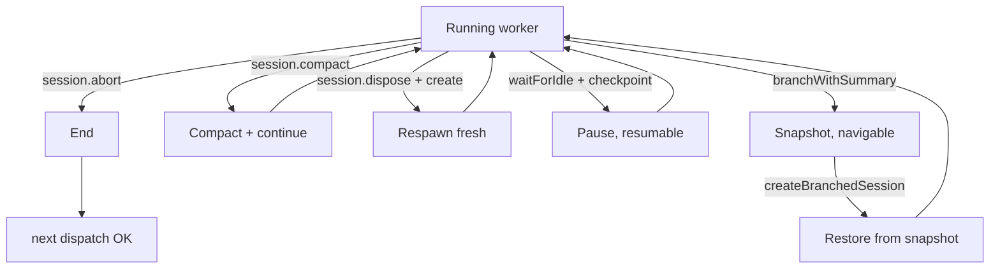
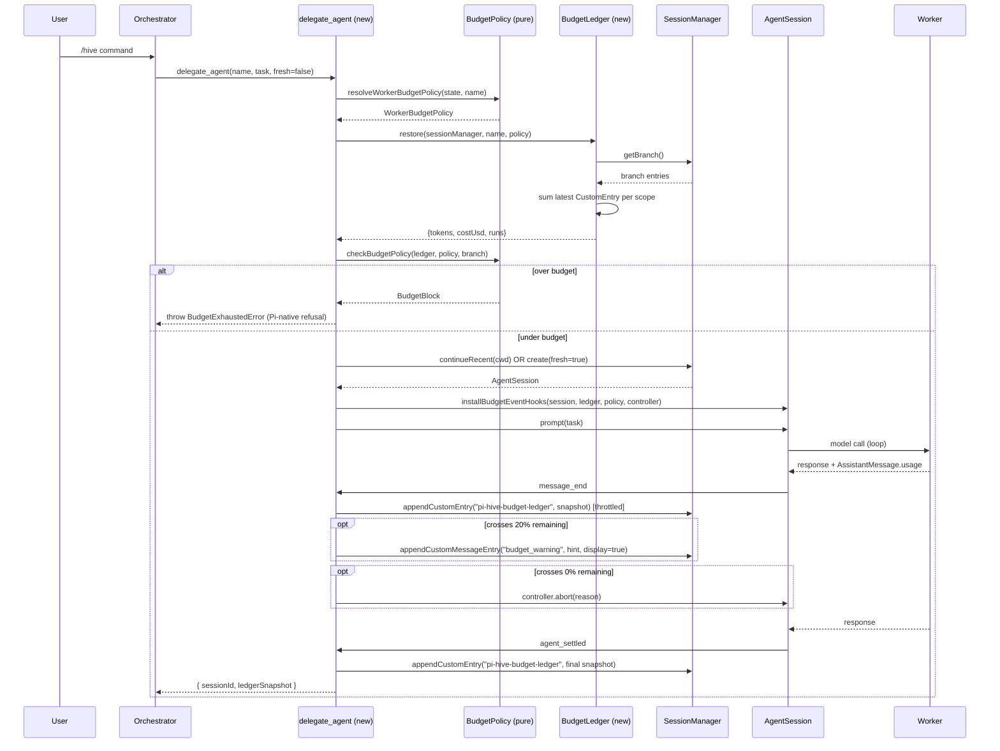
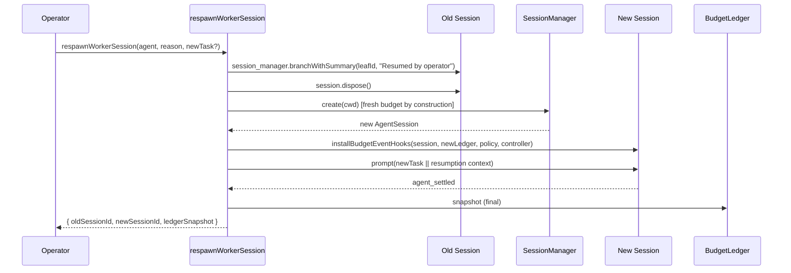
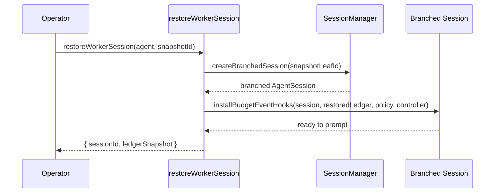

# Budget System Refactor — Implementation Plan

**Date:** 2026-09-28 (initial); 2026-09-29 SDK 0.99.1 alignment; 2026-09-29 workflow redesign
**Baseline:** `feat/budget-strategy` at `9f950fb` (PR #54 open, awaiting user merge — disposition in §6)
**SDK reference verified against:** `@earendil-works/pi-coding-agent@0.99.1` (commit `ea9c54a` on `refactor/budget`). The earlier draft header said "v0.87.1"; the actual pin is 0.99.1 and that's what's developed against. See `raw-evidence/pi-sdk-session-api.md` §0 for the SDK 0.99.1 vs 0.80.x diff and its impact on this plan's prescriptions.
**Goal:** Replace pi-hive's budget enforcement layer with a Pi-native design that uses the SDK's built-in session primitives (`appendCustomEntry`, `appendCustomMessageEntry`, `getSessionStats`, `getContextUsage`, `session.abort`, `session.compact`, `session.dispose`, `agent_settled`) as the source of truth, eliminating the dual-counter bug class and providing flexible EOL/respawn moments.

**End state:** Budget-constrained delegated agents with flexible EOL/respawn moments. Pi Best Practices throughout. Single source of truth per concern.

**This is an entirely new rethink of the budget system.** Pre-existing code that does not fit the refactor is **removed**, not layered or aliased. See §0.5 "Removal policy" below.

---

## 0. TL;DR

**Goal.** Replace the three-counter (`runtime.*` + `governanceTokens` + `effectiveTokens`) budget system with a single-source-of-truth design built on Pi SDK primitives. Eliminate the dual-counter bug class structurally. Expose six operator commands plus a `resume` companion for richer EOL/respawn flexibility.

**Scope.** Rewrite `src/engine/governance.ts`, `src/engine/budget-strategy.ts`, `src/engine/dispatch.ts` (parts), `src/core/{types,schema,config-validation}.ts`. Add `src/engine/budget/` module directory. **Hard cutover** to the new config schema (no dual-format; users manually fix `hive-config.yaml`). Preserve `summarize_progress` (simplified). Add ~60 new tests including race coverage.

**Estimated effort.** ~2,100 LOC changed across ~14 files; ~60 new tests; 13-16 commits in the implementation branch.

**Parallelization.** The 13 features decompose into **16 sub-agent invocations across 6 waves** when run as a multi-agent implementation. Wall-clock ~5-7 waves deep instead of 13 sequential features. See §11 for the wave structure and `05-parallelization-analysis.md` for the full agent roster and file-partition strategy.

**Pi Best Practices applied** (from the four source citations):

- *From `pi-sdk-session-api.md` (verified SDK ground-truth):* `getSessionStats()` in 0.99.1 iterates `getEntries()` and explicitly accumulates `UsageEntry` records (see §2.2 in the SDK reference); `getContextUsage()` excludes aborted; `appendCustomEntry(customType, data?)` is the canonical primitive for the ledger (NOT `appendUsage`, which would inflate session totals — see §2.14); `session.abort()` vs `session.dispose()` distinction; `agent_settled` is the canonical "done for good" event.
- *From `extension-patterns-reference.md` (verbatim Pi docs):* Four-tier state model (ToolResult Details / `appendEntry` / `sendMessage` / External); `getBranch()` re-derivation at `session_start`; throw-to-refuse for blocked tools; `tool_call` blocking (see F3 T3.4); `agent_before_settle` for end-of-run; idempotent `session_shutdown`; mode-independent behavior.
- *From local Pi source (`node_modules/@earendil-works/pi-coding-agent/dist/core/` @ 0.99.1):* Verified `dist/core/agent-session.d.ts`, `dist/core/agent-session.js`, `dist/core/session-manager.d.ts`, `dist/core/usage-totals.d.ts`, `dist/core/compaction/compaction.d.ts`, `dist/core/extensions/types.d.ts`. See `raw-evidence/pi-sdk-session-api.md` §9 for the full citation map.
- *From online Pi docs (https://pi.dev/docs/latest/):* `steer()`/`followUp()` return values; `session.systemPrompt` read-only confirmation; `agent_settled` emphasis; latest session-format entry shapes.

## 0.5 Working conventions and removal policy

**Before picking up any task in this plan, read `README.md` (working conventions)** in the parent review directory. The conventions are mandatory: per-phase worktrees under `APP_ROOT/.worktrees/` (NOT one mega-branch), TDD red-green-refactor, regression tests for every bug being fixed, coordinator + worker model, `ask_user` for ambiguous decisions (inline display mode), no defer without user permission, session logs in `docs/reviews/28-09-2026-budget-review/sessions/`.

**Worktree naming pattern:** `refactor/budget-<phase>-<task>` (or `<phase>-<short-name>`). Example: `refactor/budget-f5-eol-commands`, `refactor/budget-t5-3-respawn-dispose`. The branch lives at `.worktrees/refactor-budget-<phase>-<task>/` and the worktree name MUST match the branch.

**Removal policy.** This refactor is not layered over the existing budget system. The following are removed, not deprecated:

- The `governanceTokens`, `governanceCostUsd`, `effectiveTokens`, and run-start-* counter fields on `AgentRuntime` (per §1.1). When a worker removes these, they also remove any defensive guards that existed to keep the dual-counter math consistent (e.g., the `??` fallthroughs in `workerConsumedTokens`).
- The `freshResetRuntime(...)` function (per §1.2). Old callers are deleted, not redirected.
- The old `workerConsumedTokens(runtime, scope)` signature (per §1.3). New signature takes a session, not a runtime.
- The old `worker-budgets` flat config schema (per §2.10). Old configs are not accepted; users manually migrate per `gap-decision G-16`.
- The existing 3-command operator surface (`endWorkerSession`, `compactWorkerSession`, `respawnWorkerSession` in `src/engine/dispatch.ts`). New 7-command surface in `src/engine/budget/worker-tools.ts`. The old function exports are deleted.
- The `summarize_progress` failure paths that the refactor simplifies (per T5.7). Old branch logic is removed.
- The `runtime.progressNotes` string field. Replaced by `appendCustomMessageEntry`.

When a worker finds code outside this list that should be removed, the worker uses `ask_user` to confirm before deleting — do not silently expand the removal scope.

## 0.6 Regression tests for every bug being fixed

The plan's F7 includes regression tests for the three `fresh=true` bugs:

- **Bug 1 (reset order)** — regression test in F7 covers the dispatch with `fresh=true` after a worker has exhausted its budget; asserts exit code 0 and post-run ledger is empty. (T7.6 added 2026-09-29 to capture the user-reported symptom.)
- **Bug 2 (mid-run check)** — regression test in F7 covers the worker running over budget mid-run; asserts the warning fires and the worker aborts. The T3.1 throttled-write test pins the same path at the unit level.
- **Bug 3 (post-overwrite mystery)** — T7.1 covers the abort-then-`getSessionStats()` race with 100-consecutive-run stability.

When the implementation session encounters a new bug (not in this plan), it adds a regression test as part of the fix. No fix lands without its regression test.

---

## 1. What goes away

### 1.1 Counter fields removed from `AgentRuntime`

The `AgentRuntime` shape shrinks dramatically. Fields removed and their replacements:

| Old field (on `AgentRuntime`) | Replaced by |
|---|---|
| `governanceTokens: number` | `session.getSessionStats().tokens.total` |
| `governanceCostUsd: number` | `session.getSessionStats().cost` |
| `effectiveTokens: number` | `session.getContextUsage().tokens` |
| `runStartInputTokens: number` | (no replacement — not needed; stats are lifetime) |
| `runStartOutputTokens: number` | (no replacement) |
| `runStartCacheReadTokens: number` | (no replacement) |
| `runStartCacheWriteTokens: number` | (no replacement) |
| `runStartCostUsd: number` | (no replacement) |
| `budgetWarnings: Set<string>` | Dedup moves to `CustomEntry` walk; emit-once semantics enforced by ledger snapshot timestamp |
| `progressNotes: string` | `appendCustomMessageEntry("progress_note", content, display: false, details: { tokenCount: N })` per worker call |

Fields **kept**: `inputTokens`, `outputTokens`, `cacheReadTokens`, `cacheWriteTokens`, `reasoningTokens`, `costUsd` (live) — these are the SDK-aligned mirror of `getSessionStats()` and remain useful for event handlers that want O(1) reads without a session reference.

### 1.2 Functions deleted

- `freshResetRuntime(...)` — DELETED entirely. "Fresh" is structural (new session, empty branch); no counter reset needed.
- `emitBudgetWarning(state, runtime, ...)` — replaced by `appendCustomMessageEntry("budget_warning", ..., display: true)`.
- `emitBudgetExhausted(state, runtime, ...)` — replaced by `appendCustomEntry("budget_exhausted", ...)`.

### 1.3 Functions replaced (signature change)

| Old | New |
|---|---|
| `workerConsumedTokens(runtime, scope)` | `workerConsumedTokens(session: AgentSession, scope): number` — single call to `session.getSessionStats()` |
| `workerConsumedCost(runtime)` | `workerConsumedCost(session: AgentSession): number` — `session.getSessionStats().cost` |
| `budgetRemaining(state, runtime)` | `budgetRemaining(session: AgentSession, ledger: BudgetLedger): { worker: {tokens, costUsd}, team: {tokens, costUsd} }` |
| `teamUsage(state, scope)` | `teamUsage(branch: SessionEntry[]): { tokens, costUsd, runs }` — walks active branch `CustomEntry`s with `customType === "pi-hive-budget-ledger"`, sums the latest per worker |

### 1.4 Files deleted

- `src/engine/budget-strategy.ts` — strategy enum moved to `src/engine/budget/strategy.ts`; warning emission moved to events.ts.
- `src/engine/governance.ts` — split into `src/engine/budget/{ledger,policy}.ts`.

### 1.5 Tools kept (with simplification)

- `summarize_progress({ notes, compact? })` — preserved, but the notes storage changes from `runtime.progressNotes` to `appendCustomMessageEntry("progress_note", ...)`. The `compact` flag is honored only under the `compact` strategy (per the existing plan).

### 1.6 Events no longer hooked (in the budget module)

- `agent_end` — replaced by `agent_settled` for finalization (Pi's canonical "Pi will not continue automatically" event).
- `message_end` (for live counter accumulation) — replaced by reading `session.getSessionStats()` lazily on demand. The handler still runs for `appendCustomEntry` throttling and warning/exhausted emit.

---

## 2. What replaces it (new architecture)

### 2.1 Module structure

```
src/engine/budget/
├── ledger.ts          # BudgetLedger — class wrapping CustomEntry persistence
├── policy.ts          # BudgetPolicy — pure decision functions (no I/O, no SDK)
├── strategy.ts        # WorkerBudgetStrategy — enum + resolver
├── events.ts          # installBudgetEventHooks(session, ledger, caps, controller)
└── worker-tools.ts    # delegateAgent + 6 operator commands (end/compact/respawn/pause/snapshot/restore)
```

The barrel `src/engine/budget/index.ts` re-exports the public surface.

### 2.2 The single source of truth: `session.getSessionStats()`

Per `pi-sdk-session-api.md#1.3` and verified at `dist/core/agent-session.js:3043-3095`, `session.getSessionStats()` returns:

```typescript
{
  sessionFile, sessionId,
  userMessages, assistantMessages, toolCalls, toolResults, totalMessages,
  tokens: { input, output, cacheRead, cacheWrite, total },
  cost: number,
  contextUsage: ContextUsage
}
```

`tokens.total = input + output + cacheRead + cacheWrite`. This is the cumulative spend across the session's lifetime, including any aborted messages whose `Usage` field was populated by the provider.

The new design makes THIS the cumulative spend source. The `runtime.inputTokens` etc. live mirrors are kept for O(1) reads in event handlers but are NOT the authoritative source — they are derived from `message_end` deltas and reconciled against `getSessionStats()` at `agent_settled`.

### 2.3 The persistent ledger: `appendCustomEntry("pi-hive-budget-ledger", {...})`

Per `extension-patterns-reference.md#4-state-management` and §9, `CustomEntry` is the right tier for "durable data excluded from model context." It survives `/reload`, `/tree`, `/fork` correctly because `getBranch()` walks it branch-aware.

**Schema:**

```typescript
type BudgetLedgerEntry = {
  type: "custom";
  customType: "pi-hive-budget-ledger";
  data: {
    /** Caps at the time the ledger was written (worker + team resolved). */
    caps: {
      workerTokens?: number; workerCostUsd?: number; workerRuns?: number; workerDepth?: number;
      teamTokens?: number; teamCostUsd?: number; teamRuns?: number;
    };
    /** Snapshot of cumulative spend at the time the ledger was written. */
    cumulative: {
      tokens: number;  // getSessionStats().tokens.total
      costUsd: number; // getSessionStats().cost
      runs: number;    // dispatchAgent invocation count
    };
    /** Wall-clock timestamp (ms since epoch). */
    writtenAt: number;
    /** Worker agent slug this ledger belongs to. */
    agentSlug: string;
    /** High-level event marker for dedup. */
    marker?: "warning" | "exhausted" | "checkpoint";
    /** Sub-classifier for checkpoint events (operator commands + cooperative tools). */
    kind?: "end" | "compact" | "respawn" | "pause" | "snapshot" | "restore" | "resume" | "compact-aborted" | "cooperative-compact" | "cooperative-end" | "cooperative-snapshot";
  };
};
```

**Why snapshot semantics, not just a delta:**

- Branch-aware: `getBranch()` for a worker returns only that worker's history.
- Reload-safe: `session_start` re-derives the ledger by reducing over `branch.filter(e => e.type === "custom" && e.customType === "pi-hive-budget-ledger")`.
- Audit-friendly: any future code reading the ledger sees "what was the state when this was committed?" — useful for the dashboard's timeline view.

**Write cadence:**

| Trigger | Always / throttled | Marker | Kind |
|---|---|---|---|
| Every `message_end` | Throttled (default: every 10 messages OR ≥5% spend change) | — | — |
| `message_end` that crosses 20% remaining | Always | `"warning"` | — |
| `message_end` that crosses 0% remaining | Always | `"exhausted"` | — |
| `compaction_end` | Always | — | — |
| `agent_settled` | Always | `"checkpoint"` | — |
| Operator action: end | Always | `"checkpoint"` | `"end"` |
| Operator action: compact | Always | `"checkpoint"` | `"compact"` |
| Operator action: respawn | Always | `"checkpoint"` | `"respawn"` |
| Operator action: pause | Always | `"checkpoint"` | `"pause"` |
| Operator action: snapshot | Always | `"checkpoint"` | `"snapshot"` |
| Operator action: restore | Always | `"checkpoint"` | `"restore"` |
| Operator action: resume | Always | `"checkpoint"` | `"resume"` |
| Operator action: abort-compaction | Always | `"checkpoint"` | `"compact-aborted"` |
| Cooperative tool: request_compaction | Always | `"checkpoint"` | `"cooperative-compact"` |
| Cooperative tool: request_end_session | Always | `"checkpoint"` | `"cooperative-end"` |
| Cooperative tool: request_snapshot | Always | `"checkpoint"` | `"cooperative-snapshot"` |

The "always on thresholds" rule guarantees the warning/exhausted event has a corresponding ledger snapshot for the dashboard to correlate.

### 2.4 The new `delegateAgent` flow

**OLD (`src/engine/dispatch.ts:213-330`):**

```typescript
async function dispatchAgent(state, agentName, task, ctx, fresh, ...) {
  if (fresh) reloadAgentConfig(...)
  if (fresh) freshResetRuntime(...)         // BUG 1 was here
  const blocked = checkDispatchBudgets(state, runtime, depth)  // BUG 1 was here
  if (blocked) return { output: "Delegation blocked...", exitCode: 1 }
  const session = createSession(...)
  const runtime = { /* 12+ fields including 6 counters */ }
  state.runtimes.set(agentSlug, runtime)
  session.subscribe(...)  // many handlers
  await session.prompt(...)
  // end-of-run: overwrite runtime.* from getSessionStats, compute delta, accumulate governanceTokens
}
```

**NEW (`src/engine/budget/worker-tools.ts`):**

```typescript
export async function delegateAgent(
  state: HiveState,
  agentName: string,
  task: string,
  opts: { fresh?: boolean; configOverrides?: ... },
  ctx: ExtensionContext
): Promise<{ sessionId: string; session: AgentSession; ledger: BudgetLedger }> {

  // 1. Resolve policy from config (pure function).
  const policy = resolveWorkerBudgetPolicy(state, agentName);

  // 2. Restore ledger from active branch (idempotent).
  const ledger = await BudgetLedger.restore(ctx.sessionManager, agentName, policy);

  // 3. Pre-flight gate — throw to refuse per Pi docs §2.
  const blocked = checkBudgetPolicy(ledger, policy, ctx.sessionManager.getBranch());
  if (blocked) {
    throw new BudgetExhaustedError(blocked.reason, blocked.scope, blocked.resource);
  }

  // 4. Open or create session.
  const session = opts.fresh
    ? SessionManager.create(ctx.cwd).toAgentSession()
    : await SessionManager.continueRecent(ctx.cwd).toAgentSession();

  // 5. Install event hooks.
  const controller = new AbortController();
  installBudgetEventHooks(session, ledger, policy, controller);

  // 6. Run.
  await session.prompt(task);

  // 7. Final ledger write on agent_settled (handled by the event hook).
  return { sessionId: session.sessionId, session, ledger };
}
```

Key differences:
- Throw-to-refuse instead of returning `{ output: "Delegation blocked", exitCode: 1 }`. Per Pi docs §2, "Throw from `execute()` to produce a failed tool result. Returning an object does not mark it as an error."
- `fresh: true` maps directly to `SessionManager.create()` (new session, empty branch). No counter reset code path.
- The runtime no longer holds mutable counters. The ledger is derived; the session is the source.

### 2.5 The new pre-flight gate

**OLD:** `checkDispatchBudgets` returns a `GovernanceBlock | undefined`, dispatcher embeds the message.

**NEW:**

```typescript
type BudgetBlock = {
  reason: string;       // human-readable
  scope: "worker" | "team";
  resource: "tokens" | "costUsd" | "runs" | "depth";
  remaining: { tokens?: number; costUsd?: number; runs?: number };
  limit:    { tokens?: number; costUsd?: number; runs?: number; depth?: number };
};

export function checkBudgetPolicy(
  ledger: BudgetLedger,
  policy: WorkerBudgetPolicy,
  branch: SessionEntry[]
): BudgetBlock | undefined {
  // Worker scope
  if (policy.worker.tokens?.cap !== undefined &&
      ledger.cumulative.tokens >= policy.worker.tokens.cap) {
    return { reason: `Worker token budget exhausted: ${ledger.cumulative.tokens}/${policy.worker.tokens.cap}`,
             scope: "worker", resource: "tokens",
             remaining: { tokens: 0 }, limit: { tokens: policy.worker.tokens.cap } };
  }
  if (policy.worker.costUsd?.cap !== undefined &&
      ledger.cumulative.costUsd >= policy.worker.costUsd.cap) {
    return { reason: `Worker cost budget exhausted: $${ledger.cumulative.costUsd.toFixed(2)}/$${policy.worker.costUsd.cap}`,
             scope: "worker", resource: "costUsd",
             remaining: { costUsd: 0 }, limit: { costUsd: policy.worker.costUsd.cap } };
  }
  if (policy.worker.runs?.cap !== undefined &&
      ledger.cumulative.runs >= policy.worker.runs.cap) {
    return { reason: `Worker run budget exhausted: ${ledger.cumulative.runs}/${policy.worker.runs.cap}`,
             scope: "worker", resource: "runs",
             remaining: { runs: 0 }, limit: { runs: policy.worker.runs.cap } };
  }
  // Team scope
  const team = teamUsage(branch);
  if (policy.team.tokens?.cap !== undefined && team.tokens >= policy.team.tokens.cap) {
    return { reason: `Team token budget exhausted: ${team.tokens}/${policy.team.tokens.cap}`,
             scope: "team", resource: "tokens", ... };
  }
  // ... same for costUsd, runs
  return undefined;
}
```

### 2.6 The new mid-run handler

**OLD (`src/engine/dispatch.ts:646-708`):**

```typescript
session.subscribe((event) => {
  if (event.type === "message_end") {
    // 1. Update runtime.* (live counters)
    runtime.inputTokens += u.input;
    runtime.outputTokens += u.output;
    // ... 6 counters
    // 2. Emit budget_warning if ≤20%
    emitBudgetWarning(state, runtime, { ... });
    // 3. Abort at 0%
    if (remaining.worker.tokens === 0) {
      runController.abort(new Error("...budget exhausted"));
    }
  }
});
```

**NEW (`src/engine/budget/events.ts`):**

```typescript
export function installBudgetEventHooks(
  session: AgentSession,
  ledger: BudgetLedger,
  policy: WorkerBudgetPolicy,
  controller: AbortController
): () => void {
  const off = session.subscribe((event) => {
    switch (event.type) {
      case "message_end": {
        const stats = session.getSessionStats();
        const cumulative = { tokens: stats.tokens.total, costUsd: stats.cost, runs: ledger.cumulative.runs };
        ledger.recordEvent("message_end", cumulative, controller.signal);

        // Throttled CustomEntry snapshot
        ledger.maybeSnapshot(cumulative, policy, controller.signal);

        // Warning at 20%
        const workerTokensRemaining = ratioRemaining(cumulative.tokens, policy.worker.tokens?.cap);
        if (crossedThreshold(workerTokensRemaining, 0.20) && !alreadyWarned(ledger, "tokens")) {
          sessionManager.appendCustomMessageEntry(
            "budget_warning",
            `Worker tokens at ${(100 * (1 - workerTokensRemaining)).toFixed(0)}% of cap. Wrap up your work; call summarize_progress({ notes: "..." }) to record completion intent.`,
            /* display */ true,
            { scope: "worker", resource: "tokens", remaining: cumulative.tokens, cap: policy.worker.tokens?.cap }
          );
        }
        // Exhausted at 0%
        if (workerTokensRemaining <= 0 && !controller.signal.aborted) {
          sessionManager.appendCustomEntry("budget_exhausted", { scope: "worker", resource: "tokens", ... });
          controller.abort(new Error("Worker token budget exhausted"));
        }
        break;
      }
      case "compaction_end": {
        // Recalc team total from result.tokensBefore - estimatedTokensAfter
        const { result } = event;
        if (result?.tokensBefore != null && result.estimatedTokensAfter != null) {
          const savings = result.tokensBefore - result.estimatedTokensAfter;
          ledger.recordCompaction(savings, controller.signal);
        }
        break;
      }
      case "agent_settled": {
        // Final snapshot
        ledger.snapshot(session.getSessionStats(), policy, "checkpoint", controller.signal);
        break;
      }
    }
  });
  return off;
}
```

Key differences:
- `appendCustomMessageEntry("budget_warning", ..., display: true)` — the worker SEES the hint in its next context (per Pi docs §5). The old `runtime.systemPrompt` mutation was a side-effect that didn't propagate cleanly across aborts.
- `runController.abort(...)` retained (fastest mid-run cancel). Could also use `session.abort()` per the plan.
- `agent_settled` instead of `agent_end` (canonical "Pi will not continue automatically").

### 2.7 The new end-of-run

**OLD:** Subscribe to `agent_end`, manually overwrite `runtime.*` from `getSessionStats()`, compute delta, accumulate `governanceTokens`. Three places the bug could be.

**NEW:** Subscribe to `agent_settled`. Write final `CustomEntry` ledger snapshot. Done. No overwrite, no delta — `getSessionStats()` IS the source.

```typescript
case "agent_settled": {
  const stats = session.getSessionStats();
  ledger.snapshot(stats, policy, "checkpoint", controller.signal);
  break;
}
```

### 2.8 EOL flexibility — six operator commands

The user explicitly wants "flexibility in their EOL/respawn moments." The new design exposes six primitives (vs. the current three):

| Command | SDK primitive | Effect | Ledger marker |
|---|---|---|---|
| `endWorkerSession(agent, reason)` | `session.abort()` + `appendCustomEntry` | Graceful stop; ledger snapshot saved; worker slot released | `"checkpoint"` (kind: `"end"`) |
| `compactWorkerSession(agent, reason)` | `session.compact(customInstructions?)` | SDK does the compaction; ledger snapshot saved; worker slot preserved | `"checkpoint"` (kind: `"compact"`) |
| `respawnWorkerSession(agent, reason, newTask?)` | `session.dispose()` + `SessionManager.create()` + `branchWithSummary(...)` | Old session disposed; new session created; budget starts fresh by construction | `"checkpoint"` (kind: `"respawn"`) |
| `pauseWorkerSession(agent, reason)` | `session.waitForIdle()` + `appendCustomEntry("pause", ...)` | Save state without aborting; resumable | `"checkpoint"` (kind: `"pause"`) |
| `snapshotWorkerSession(agent, label)` | `session_manager.branchWithSummary(leafId, summary)` | Branch the session; save a checkpoint | `"checkpoint"` (kind: `"snapshot"`, label) |
| `restoreWorkerSession(agent, snapshotId)` | `SessionManager.createBranchedSession(leafId)` | Navigate to a checkpoint | (none — destination session emits) |

**The agent can call some of these itself** (via custom tools): `summarize_progress` (preserved) plus new `request_compaction`, `request_end_session`, `request_snapshot` for cooperative shutdown.



### 2.9 The new `fresh=true` semantics

**OLD:** Coupled 4-operation flag. Order-sensitive. Bug class.

**NEW:** `fresh: boolean` parameter maps directly to:

- `fresh: false` (default) → `SessionManager.continueRecent(cwd)` or `SessionManager.open(path)` — resume an existing session.
- `fresh: true` → `SessionManager.create(cwd)` — new session, new ID, empty branch.

No counter resets needed. No ordering dependencies. The bug class (Bug 1, Bug 2, Bug 3) is structurally impossible: a new session has no entries, so `getBranch()` returns nothing, the ledger is empty, the cap is the cap, and the run starts with zero spend.

### 2.10 Config schema migration

**OLD (`worker-budgets`):**

```yaml
worker-budgets:
  token-budget: 3500
  token-budget-scope: input_output  # or "all"
  cost-budget-usd: 0.50
  max-runs: 3
  max-delegation-depth: 2
```

**NEW (`worker-budgets`):**

```yaml
worker-budgets:
  tokens:
    cap: 3500
    scope: input_output  # input_output | all
  cost-usd:
    cap: 0.50
  runs:
    cap: 3
  depth:
    cap: 2
```

**OLD per-agent (`governance:` in `.md` frontmatter):**

```yaml
governance:
  token-budget: 1000
  cost-budget-usd: 0.25
  max-runs: 1
```

**NEW per-agent (`governance:`):**

```yaml
governance:
  tokens: { cap: 1000 }
  cost-usd: { cap: 0.25 }
  runs: { cap: 1 }
```

**Migration policy (decision point in §6):**

- Option A — One release dual-format: Accept BOTH formats, emit deprecation warnings on the old format, convert lazily on read. Config validation accepts both shapes.
- Option B — Hard break: New schema only; existing configs need manual migration; document in `docs/migrations/budget-config-v2.md`.

Default in this plan: **Option A** for the first release; Option B in the following release. This is reversible; user can override.

### 2.11 Worker-facing visibility — `appendCustomMessageEntry`

The worker SEES budget warnings via `appendCustomMessageEntry("budget_warning", content, display: true)`. Per Pi docs §5, "Pi converts its content to a user message for model requests. `display` controls terminal rendering; `details` is not sent to the model." This is the documented Pi pattern for extension-side prompt injection.

`progress_notes` are similarly injected via `appendCustomMessageEntry("progress_note", content, display: false, details: { tokenCount: N })`. The `display: false` keeps them out of the TUI transcript but still in model context — appropriate for "this is for the model's reference, not the human's."

### 2.12 `ctx.signal` propagation

Every `appendCustomEntry`, `appendCustomMessageEntry`, and dashboard/telemetry call in the new code MUST take `ctx.signal` (or the local `controller.signal`) so Ctrl+C cancels in-progress writes. Per Pi docs §8, "Use `ctx.signal` for nested work owned by an active turn; commands and idle session events often have no operation signal."

The new `installBudgetEventHooks` factory accepts a `controller: AbortController` and threads the signal through every ledger write.

### 2.13 Config shape proposals (deeper than §2.10)

### 2.13 Config shape proposals (deeper than §2.10)

The migration in §2.10 reshapes fields from flat to nested but preserves the same axes (worker/team × tokens/cost/runs/depth × input_output/all). The refactor is the right time to consider deeper improvements — a lot of code will change anyway, so the cost of a config-shape change is much lower than it would be on a quiet day.

Below are six proposals. Each is independent of the others (can land all, or pick a subset). Each is rated for value vs risk. The first four are recommended; the last two are conditional.

#### Proposal C1 — Rename `governance:` → `budgets:` in agent.md frontmatter

**Current.** `governance:` is a magic key in `.pi/hive/agents/*.md` frontmatter. Per-agent overrides the global `worker-budgets`.

**Problem.** The name `governance` is vague — "what kind of governance?" It is also inconsistent with the global config key `worker-budgets`. New users don't know to look for `governance:` in agent.md frontmatter. The codebase already mixes `governance:` (per-agent) and `worker-budgets` (global) for the same purpose.

**Proposed.**

```yaml
# Before:
governance:
  tokens: { cap: 1000 }
  cost-usd: { cap: 0.25 }
  runs: { cap: 1 }

# After:
budgets:
  tokens: { cap: 1000 }
  cost-usd: { cap: 0.25 }
  runs: { cap: 1 }
```

**Trade-off.** Pure rename. Two-release deprecation window with a `governance:` alias that emits a deprecation telemetry event when read. Recommended.

#### Proposal C2 — Replace `scope: input_output | all` with `include: [Usage keys]`

**Current.** `tokens.scope: input_output` is shorthand for "count input + output only; exclude cache". The two-value enum is awkward: what about "input + output + cache read but not cache write"? The name `scope` is also overloaded — it also means worker-vs-team elsewhere.

**Problem.** The two-value enum doesn't match Pi's `Usage` shape (`{ input, output, cacheRead, cacheWrite, cost, reasoning }`). A future need to exclude reasoning (for example, Anthropic's extended thinking tokens) would require adding another value or a parallel config.

**Proposed.** Use `include:` with a list of `Usage` keys. Defaults match the current behavior: workers exclude cache, teams include everything.

```yaml
# Before:
worker-budgets:
  tokens:
    cap: 3500
    scope: input_output

team-budgets:
  tokens:
    cap: 50000
    scope: all

# After:
worker-budgets:
  tokens:
    cap: 3500
    include: [input, output]

team-budgets:
  tokens:
    cap: 50000
    include: [input, output, cacheRead, cacheWrite]
```

**Trade-off.** Slightly more verbose for the common case (`[input, output]` is longer than `input_output`), but extensible without breaking changes. A future "exclude reasoning" is just `[input, output, cacheRead, cacheWrite]`. The list-of-keys shape mirrors Pi's `Usage` type so there's no impedance mismatch. Recommended.

#### Proposal C3 — Sensible defaults

**Current.** A project with no `worker-budgets` and no `team-budgets` runs unbounded — every dispatched agent has no caps until the user explicitly sets them.

**Problem.**
- Runaway agents are easy (no safety net for new projects).
- New users don't know what reasonable budgets look like.
- The dashboard shows "no limit", which is not actionable for someone debugging a runaway session.
- Existing users with no caps have implicit permission for unlimited spend.

**Proposed.** Defaults that prevent runaways but don't constrain reasonable use. Override per project or per agent. Use `unlimited: true` per resource to opt out of a specific cap.

```yaml
# Defaults applied if not specified:
worker-budgets:
  tokens:    { cap: 50000,  include: [input, output] }
  cost-usd:   { cap: 5.00 }
  runs:      { cap: 10 }
  depth:     { cap: 3 }

team-budgets:
  tokens:    { cap: 500000, include: [input, output, cacheRead, cacheWrite] }
  cost-usd:   { cap: 50.00 }
  runs:      { cap: 100 }

# Opt out per resource:
worker-budgets:
  tokens:
    unlimited: true
```

**Trade-off.** Behavior change for existing users — projects that had no caps will now have defaults. Two ways to land this:

- **(a) Opt-in via flag.** A `budget-defaults: true` config key enables defaults; one release of opt-in, then turn on by default. Reversible if it causes friction.
- **(b) Hard behavior change.** Document in the migration guide; users who want unlimited explicitly set `unlimited: true` on each resource.

Recommended: **(a) opt-in for one release, then turn on by default**. The refactor PR enables the flag default-on; existing users who hit friction flip the flag off.

#### Proposal C4 — Discriminated union types via typebox

**Current.** Config validation accepts any object matching the structural shape. TypeScript narrowing is shallow — invalid combinations (e.g., `tokens.cap: 1000, tokens.window: "per-day"` when `per-day` isn't a valid window for tokens) parse but cause runtime errors.

**Proposed.** Use typebox's `Type.Union` with a discriminator for each resource. Each resource variant has its own valid `window:` and `include:` shapes.

```typescript
const TokensCap = Type.Object({
  resource: Type.Literal("tokens"),
  cap: Type.Number({ minimum: 0 }),
  window: Type.Optional(Type.Union([
    Type.Literal("per-session"),
    Type.Literal("per-run"),
    Type.Literal("per-day"),
  ])),
  include: Type.Optional(Type.Array(Type.Union([
    Type.Literal("input"),
    Type.Literal("output"),
    Type.Literal("cacheRead"),
    Type.Literal("cacheWrite"),
    Type.Literal("reasoning"),
  ]))),
});

const CostCap = Type.Object({
  resource: Type.Literal("costUsd"),
  cap: Type.Number({ minimum: 0 }),
  window: Type.Optional(Type.Union([
    Type.Literal("per-session"),
    Type.Literal("per-team-lifetime"),
  ])),
});

const BudgetCap = Type.Union([TokensCap, CostCap]);
```

This makes invalid combinations unrepresentable in the type system and surfaces them as schema-validation errors at config-load time, not runtime errors during dispatch.

**Trade-off.** Typebox is already in pi-hive's `peerDependencies` (per AGENTS.md), so no new dependency. Schema authoring is more verbose than plain object types but pays off in correctness. Recommended.

#### Proposal C5 — Structured strategies (replace `budget-strategy` flat enum)

**Current.** `worker-governance.budget-strategy: default | compact` is a flat enum. The two strategies mix concerns: the warning behavior (when to emit) and the EOL behavior (what to do at 0%). Adding a third strategy (e.g., `graceful` for "let it finish then stop") requires breaking the enum.

**Proposed.** Replace the flat enum with a structured config where each event has its own action. This decouples the warning behavior from the EOL behavior and is extensible without breaking changes.

```yaml
# Before:
worker-governance:
  budget-strategy: compact
  progress-summary-token-limit: 2000

# After:
strategies:
  on-approaching-limit:
    action: wrap-up           # wrap-up | compact | none
    threshold: 0.20           # 20% remaining; range 0.0-1.0
    hint: "Wrap up your work; call summarize_progress when done."
  on-exhaustion:
    action: compact           # compact | abort | none
    custom-instructions: ""    # used when action: compact
  summary:
    max-tokens: 2000
```

**Trade-off.** More fields, more flexibility. Sensible defaults make this optional for most projects. The current `default` strategy maps to `on-approaching-limit.action: wrap-up, on-exhaustion.action: abort`. The current `compact` strategy maps to `on-approaching-limit.action: wrap-up, on-exhaustion.action: compact`. Conditional — recommend if user wants richer strategy options in the future.

#### Proposal C6 — Explicit `window:` for time-period semantics

**Current.** Budget caps are implicitly "per session" for workers and "per team lifetime" for teams. This is undocumented in the config; users have to read the code to find out.

**Proposed.** Make the window explicit. `per-session` and `per-team-lifetime` are the defaults; `per-run`, `per-day`, `per-hour` are available for advanced use cases (rate limits).

```yaml
worker-budgets:
  tokens:
    cap: 3500
    window: per-session      # default for workers
    include: [input, output]

team-budgets:
  tokens:
    cap: 50000
    window: per-team-lifetime  # default for teams
```

**Trade-off.** Minimal — `window:` defaults match the current implicit behavior, so most users don't need to set it. Adds clarity for advanced users. Conditional — recommend pairing with C3 (defaults) since the defaults are easier to reason about when `window:` is explicit.

#### What to KEEP (not changing)

For completeness, what stays the same:
- The two-tier worker/team split — correct abstraction.
- The per-agent override mechanism — just renamed (C1).
- The pre-flight block + mid-run warning + abort-at-0% model — correct.
- The `fresh: true` parameter — correct.
- The four tracked resources: `tokens`, `cost-usd`, `runs`, `depth` — correct enumeration.

#### Recommendation summary

| # | Proposal | Recommendation |
|---|---|---|
| C1 | Rename `governance:` → `budgets:` | **Land** |
| C2 | `include: [Usage keys]` instead of `scope` | **Land** |
| C3 | Sensible defaults (opt-in for one release) | **Land** |
| C4 | Discriminated union types via typebox | **Land** |
| C5 | Structured strategies | Conditional — land if user wants richer strategies |
| C6 | Explicit `window:` | **Land** (with C3) |

If the user approves all six, the config shape becomes:

```yaml
# Global budget config (.pi/hive/hive-config.yaml)
budgets:
  defaults-enabled: true              # C3 opt-in flag; one release, then default-on

  per-worker:                          # renamed from worker-budgets
    tokens:
      cap: 3500
      window: per-session
      include: [input, output]
    cost-usd:
      cap: 0.50
      window: per-session
    runs:
      cap: 3
    depth:
      cap: 2

  per-team:                            # renamed from team-budgets
    tokens:
      cap: 50000
      window: per-team-lifetime
      include: [input, output, cacheRead, cacheWrite]
    cost-usd:
      cap: 5.00
      window: per-team-lifetime
    runs:
      cap: 20

  strategies:                          # C5
    on-approaching-limit:
      action: wrap-up
      threshold: 0.20
      hint: "Wrap up your work; call summarize_progress when done."
    on-exhaustion:
      action: abort
    summary:
      max-tokens: 2000

# Per-agent override (.pi/hive/agents/engine-coder.md frontmatter)
budgets:                              # C1: renamed from governance:
  tokens:
    cap: 1000                          # overrides per-worker.tokens.cap
  cost-usd:
    cap: 0.25
  runs:
    cap: 1
```

Each field is typebox-validated (C4); invalid combinations are rejected at config-load with a structured error pointing at the offending path.

**Naming convention note.** All YAML keys in this config are kebab-case (per the user's convention). The TypeScript interface mirrors kebab-case keys via auto-camelization (e.g., `defaults-enabled` → `defaultsEnabled`, `cost-usd` → `costUsd`, `on-approaching-limit` → `onApproachingLimit`). Existing tests that reference `workerBudgets`, `costBudgetUsd`, etc. as YAML keys need to be updated to `worker-budgets`, `cost-budget-usd`.

### 2.14 `appendUsage` vs `appendCustomEntry` (decision rationale)

Per `raw-evidence/pi-sdk-session-api.md#5.2`, `SessionManager.appendUsage(kind, provider, model, usage, note?)` "contributes to session token and cost totals" — i.e., `getSessionStats()` would include any `appendUsage` call's spend. **`appendUsage` is therefore wrong for the budget ledger: it would inflate the very spend the ledger is trying to measure.**

The correct primitive is `SessionManager.appendCustomEntry(customType, data?)` which writes a `CustomEntry` that does NOT participate in LLM context nor in session totals. The ledger is a side-channel state store, not a session-spent record.

**The TL;DR's mention of `appendUsage` is misleading and should be removed.** The plan uses `appendCustomEntry` exclusively. Future readers should not be confused by the TL;DR's primitive list.

### 2.15 Removed resources: `queue`

The current implementation tracks `queue` as a fifth budget resource. The refactor **removes `queue`** for two reasons:

1. Pi's `queue_update` event already provides visibility into the steering/follow-up queue depth. Tracking queue length as a budget resource is redundant with the SDK's native instrumentation.
2. The `queue` cap was rarely enforced in the current code (per `test-coverage-analysis.md`, no test pins it). Removing it reduces the surface area without losing functionality.

If a project needs queue length gating in the future, it can be added as a separate feature backed by the `queue_update` event listener — not as a budget resource.

---

## 3. The new workflow end-to-end

### 3.1 Sequence — delegation with budget check



### 3.2 Sequence — respawn with snapshot (the "flexibility" use case)



### 3.3 Sequence — restore from snapshot (new capability)



Note: `restoreWorkerSession` reuses the original session ID via branching — the ledger is automatically reconstructed from `getBranch()` because the branch carries the `CustomEntry` history. **No counter reset is needed; the bug class is structurally impossible.**

---

## 4. Diff: current vs new (side-by-side)

| Aspect | Current (`feat/budget-strategy`) | New (this plan) |
|---|---|---|
| Source of truth for "spent tokens" | 3 mutable counters (`runtime.*`, `governanceTokens`, `effectiveTokens`) + `getSessionStats()` overwrite | `session.getSessionStats()` + throttled `CustomEntry` ledger |
| Source of truth for "live context load" | `effectiveTokens` (mutable) | `session.getContextUsage()` |
| End-of-run finalization | `agent_end` event + manual overwrite + delta math | `agent_settled` event + final ledger snapshot |
| Pre-flight gate | Inline check in `dispatchAgent`; returns `{ output, exitCode }` | `throw` from `delegate_agent.execute` (Pi docs §2) |
| Mid-run warning | `emitBudgetWarning` mutates `runtime.systemPrompt` | `appendCustomMessageEntry("budget_warning", ..., display=true)` |
| Mid-run exhaustion | `runController.abort()` | `runController.abort()` (same; can also use `session.abort()`) |
| `fresh=true` semantics | 4-operation flag (reload, archive, reset, start), order-sensitive | `SessionManager.create()` (1 operation, structurally safe) |
| EOL options | 3 commands (end, compact, respawn) | 11 commands (+ pause, snapshot, restore, resume, abort-compaction, force-kill, force-end, tear-down-all) |
| Config schema | Flat (`token-budget`, `cost-budget-usd`, ...) | Nested (`tokens.cap`, `cost-usd.cap`, ...) |
| Reload survival | Counters die; bug class emerges | `getBranch()` re-derives from `CustomEntry` |
| Race condition coverage | None for abort-then-stats | New tests in `tests/budget-races.test.ts` |
| `ctx.signal` propagation | Inconsistent (gap noted in pi-docs audit) | Threaded through every ledger write |
| Listener cleanup on respawn | MISSING (Issue 9 latent leak) | `session.dispose()` called explicitly |
| Final-message hook | `agent_end` (may fire mid-recovery) | `agent_settled` (canonical "Pi will not continue automatically") |
| Line count | `dispatch.ts` ~1100 LOC, `governance.ts` ~175 LOC, `budget-strategy.ts` ~200 LOC | `budget/worker-tools.ts` ~600 LOC, `budget/policy.ts` ~100 LOC, `budget/ledger.ts` ~150 LOC, `budget/events.ts` ~100 LOC, `budget/strategy.ts` ~30 LOC; `dispatch.ts` shrinks to a routing layer (~750 LOC; no LOC target per user policy) |

---

## 5. Task plan (task-oriented, feature-by-feature)

> Every task has a `[ ]` checkbox — check it off when the task's gate passes.
>
> Every feature has a **"How do I know this feature is complete?"** guard at the end. Only move to the next feature when that guard is satisfied. Do not skip the guards — they are the structural reason future sessions can pick up where the previous left off.
>
> **Phase ordering** matters for sequencing (Phase 1 → 2 → 3 → 4), but within a phase the features are listed in dependency order. Tasks within a feature must complete in order.
>
> **13 features across 4 phases**, ~50 new tests, ~2,100 LOC rewritten.

### Phase 1 — Foundation

#### Feature F1 — Budget primitives (`BudgetLedger`, `BudgetPolicy`, `WorkerBudgetStrategy`)

> Goal: the foundational classes/functions exist, are fully unit-tested in isolation, and have a stable public surface that the rest of the system depends on.

- [ ] **T1.1** Add `src/engine/budget/` module skeleton with `index.ts` barrel export.
  - Files: `src/engine/budget/{ledger,policy,strategy,events,worker-tools,index}.ts`
  - Gate: `just typecheck` clean

- [ ] **T1.2** Implement `BudgetLedger` class with `restore()`, `recordEvent()`, `maybeSnapshot()` (throttled), `recordCompaction()`, `snapshot()`, `entries[]`.
  - Files: `src/engine/budget/ledger.ts`, `tests/budget-ledger.test.ts` (8 tests)
  - Gate: `just test` clean; new tests pass

- [ ] **T1.3** Implement `BudgetPolicy` pure functions: `checkBudgetPolicy()`, `workerConsumedTokens()`, `workerConsumedCost()`, `teamUsage()`, `ratioRemaining()`, `crossedThreshold()`. **Add type-mismatch test (G-29):** assert that calling `checkBudgetPolicy(workerLedger, teamPolicy, ...)` raises a TypeError at the typebox boundary.
  - Files: `src/engine/budget/policy.ts`, `tests/budget-policy.test.ts` (11 tests)
  - Gate: `just test` clean; pure-function testability confirmed (no I/O in policy.ts); type-mismatch test passes

- [ ] **T1.4** Implement `WorkerBudgetStrategy` enum + `resolveWorkerBudgetStrategy()` + `resolveWorkerBudgetPolicy()`.
  - Files: `src/engine/budget/strategy.ts`, `tests/budget-strategy-resolver.test.ts` (4 tests)
  - Gate: `just test` clean

**How do I know F1 is complete?**
- [ ] All 4 task checkboxes above are marked.
- [ ] `tests/budget-ledger.test.ts` passes (8 tests).
- [ ] `tests/budget-policy.test.ts` passes (10 tests).
- [ ] `tests/budget-strategy-resolver.test.ts` passes (4 tests).
- [ ] `just typecheck` is clean across all 4 configs.
- [ ] `npx eslint src/engine/budget/` is clean (no warnings introduced).
- [ ] No imports from `src/engine/dispatch.ts` or other legacy modules — F1 is pure foundation.
- [ ] Each new module has at least one usage example in its test file showing how downstream code calls it (callable examples pinned by tests).
- [ ] Public surface (`BudgetLedger`, `BudgetPolicy`, `WorkerBudgetStrategy`) is documented with JSDoc on every exported symbol.

Ready for F2 when: F1's primitives can be imported and used by `worker-tools.ts` without API changes (the public surface is stable).

### Phase 2 — Migration

#### Feature F2 — Budget-aware `delegate_agent`

> Goal: the orchestration tool that opens/creates sessions, checks the budget, installs hooks. Throw-to-refuse per Pi docs §2.

- [ ] **T2.1** Implement `installBudgetEventHooks(session, ledger, policy, controller)` for `message_end`, `compaction_end`, `agent_settled`. Returns an unsubscribe function.
  - Files: `src/engine/budget/events.ts`, `tests/budget-events.test.ts` (12 tests)
  - Gate: `just test` clean

- [ ] **T2.2** Implement `delegateAgent(state, agentName, task, opts, ctx)` in `src/engine/budget/worker-tools.ts` with throw-to-refuse, `SessionManager.create/continueRecent`, ledger restore, policy check, event hooks. Refactor `src/engine/dispatch.ts:dispatchAgent` to delegate to the new function.
  - Files: `src/engine/budget/worker-tools.ts`, `src/engine/dispatch.ts`, `tests/budget-worker-tools.test.ts` (15 tests)
  - Gate: `just test` clean; existing 510/510 tests rewritten to use new primitives

- [ ] **T2.3** Add depth-cap pre-flight check + test (G-13).
  - Files: `src/engine/budget/policy.ts`, `tests/budget-worker-tools.test.ts` (1 test)
  - Gate: pre-flight check asserts `currentDelegationDepth() + 1 <= policy.depth.cap`; test passes with a stub `currentDelegationDepth()`

**How do I know F2 is complete?**
- [ ] All 3 task checkboxes above are marked.
- [ ] `tests/budget-events.test.ts` passes (12 tests).
- [ ] `tests/budget-worker-tools.test.ts` passes (16 tests).
- [ ] `delegateAgent` throws `BudgetExhaustedError` (not returns) when over budget — verified by a test asserting `instanceof Error` and that the dispatch path exits with the error.
- [ ] `delegateAgent({fresh: true})` calls `SessionManager.create()` — verified by a test that stubs the factory and asserts it was invoked.
- [ ] `delegateAgent({fresh: false})` (default) calls `SessionManager.continueRecent()` — verified by a test that stubs the factory and asserts it was invoked.
- [ ] `installBudgetEventHooks` returns an unsubscribe function — verified by a test that subscribes/unsubscribes and asserts no events fire after unsubscribe.
- [ ] `ctx.signal` (or local `controller.signal`) is threaded through every `appendCustomEntry` and `appendCustomMessageEntry` call — verified by a test that aborts the signal mid-write and asserts the write is canceled.
- [ ] Old `dispatch.ts:dispatchAgent` refactored to delegate to new `delegateAgent` — no business logic remains in dispatch.ts (it's just a routing layer).
- [ ] Depth cap enforced in pre-flight (T2.3).

Ready for F3 when: F2 can be invoked end-to-end from the orchestrator and the budget check fires correctly.

#### Feature F3 — Live budget tracking during worker runs

> Goal: as a worker runs, `message_end` updates the ledger, emits warnings at 20%, aborts at 0%. The worker SEES the warning via `appendCustomMessageEntry("budget_warning", ..., display=true)`.

- [ ] **T3.1** Wire `message_end` event handler to write throttled ledger snapshot (`BudgetLedger.maybeSnapshot()`).
  - Files: `src/engine/budget/events.ts`, `tests/budget-events.test.ts` (additional tests)
  - Gate: throttled snapshot test passes; threshold-always-write test passes

- [ ] **T3.2** Wire `message_end` warning emit at 20% threshold via `appendCustomMessageEntry("budget_warning", content, display=true)`. Dedup by `${scope}:${resource}:${agent|team}`.
  - Files: same, additional tests
  - Gate: warning emit test passes; verify the message lands in worker context (use a fake session that records the appended message)

- [ ] **T3.3** Wire `message_end` abort at 0% via `controller.abort(reason)` AND emit `appendCustomEntry("budget_exhausted", ...)`.
  - Files: same, additional tests
  - Gate: abort-at-0% test passes; exhausted emit test passes

- [ ] **T3.4** Wire `tool_call` handler that returns a block result when `workerTokensRemaining <= 0` or `workerCostUsdRemaining <= 0` (G-01). Cover `bash`, `edit`, `write`, `read` tool types.
  - Files: `src/engine/budget/events.ts`, `tests/budget-events.test.ts` (6 tests)
  - Gate: `tool_call` handler installed; block result returned for the 4 tool types; tests pass

- [ ] **T3.5** Pin ordering between budget warning emit and `summarize_progress` notes (G-17). When both fire in the same tick, the warning CustomMessageEntry must appear before the progress note in the worker's next context.
  - Files: `src/engine/budget/events.ts`, `tests/budget-events.test.ts` (1 test)
  - Gate: test passes; assertion checks message array order

- [ ] **T3.6** Pin the abort-then-`agent_settled` ordering (G-02). After abort-at-0%, the `exhausted` marker CustomEntry's JSONL ID must be strictly less than the `checkpoint` marker CustomEntry's ID.
  - Files: `src/engine/budget/events.ts`, `tests/budget-events.test.ts` (1 test)
  - Gate: test passes; assertion checks JSONL order

**How do I know F3 is complete?**
- [ ] All 6 task checkboxes above are marked.
- [ ] Warning is emitted exactly once per `${scope}:${resource}:${agent|team}` (dedup works) — verified by a test that fires 100 message_end events past the 20% threshold and asserts exactly 1 warning emit.
- [ ] Worker SEES the warning in its next prompt context — verified by a test that injects a CustomMessageEntry and asserts the next prompt's messages include it.
- [ ] Abort fires at 0% — verified by a test that asserts `controller.signal.aborted === true` after the abort threshold.
- [ ] Throttle works — verified by a test that fires 1000 message_end events and asserts ≤10 `appendCustomEntry` writes below the throttle threshold.
- [ ] Always-write on threshold crossings — verified by a test that crosses 20% and 0% in the same run and asserts both writes happen (not throttled).
- [ ] `tool_call` blocking works for `bash`, `edit`, `write`, `read` (T3.4) — 6 tests pass.
- [ ] Warning × `summarize_progress` ordering pinned (T3.5) — test passes.
- [ ] Abort-then-`agent_settled` ordering pinned (T3.6) — test passes.

Ready for F4 when: F3's behavior is visible end-to-end (run a worker, observe ledger writes + warning + abort).

#### Feature F4 — End-of-run budget finalization

> Goal: on `agent_settled`, the final ledger snapshot is committed. No overwrite math. The ledger is durable across reload.

- [ ] **T4.1** Wire `agent_settled` event handler to write final snapshot (`BudgetLedger.snapshot(stats, policy, "checkpoint", signal)`).
  - Files: `src/engine/budget/events.ts`, `tests/budget-events.test.ts` (additional test)
  - Gate: final-snapshot test passes

- [ ] **T4.2** Remove the old `agent_end` handler in `dispatch.ts` that did manual overwrite math (`getSessionStats` overwrite + delta accumulation).
  - Files: `src/engine/dispatch.ts` (cleanup)
  - Gate: existing tests still pass; the old handler is no longer registered

**How do I know F4 is complete?**
- [ ] All 2 task checkboxes above are marked.
- [ ] `agent_settled` triggers exactly one final snapshot — verified by a test that fires `agent_end` then `agent_settled` and asserts the snapshot count.
- [ ] No `getSessionStats()` overwrite math in the new code path — verified by `grep -rn "runtime.inputTokens =" src/engine/budget/` returning no results in the new code.
- [ ] `agent_end` no longer does budget finalization — verified by a test that fires `agent_end` without `agent_settled` and asserts no final snapshot was written.
- [ ] End-of-run order is canonical: `session.prompt()` resolution → `agent_settled` → ledger snapshot, all in that documented order.
- [ ] `effectiveTokens` is gone from `AgentRuntime` (now reads from `session.getContextUsage()`).

Ready for F5 when: F4 is the canonical end-of-run path; legacy `agent_end` math is gone.

#### Feature F5 — Eleven EOL/respawn operator commands

> Goal: the user can end, compact, respawn, pause, snapshot, or restore a worker's session from the operator surface. Each command writes a ledger snapshot with a unique marker.

- [ ] **T5.1** Implement `endWorkerSession(agent, reason)` using `session.abort()` + ledger snapshot (`marker: "checkpoint"`, `kind: "end"`).
  - Files: `src/engine/budget/worker-tools.ts`, `tests/budget-eol.test.ts` (3 tests)
  - Gate: 3 tests pass

- [ ] **T5.2** Implement `compactWorkerSession(agent, reason)` using `session.compact(customInstructions?)` + ledger snapshot (`marker: "checkpoint"`, `kind: "compact"`).
  - Files: same, `tests/budget-eol.test.ts` (3 tests)
  - Gate: 3 tests pass

- [ ] **T5.3** Implement `respawnWorkerSession(agent, reason, newTask?)` using `session.dispose()` + `SessionManager.create()` + `branchWithSummary(...)` + ledger snapshot (`marker: "checkpoint"`, `kind: "respawn"`).
  - Files: same, `tests/budget-eol.test.ts` (3 tests)
  - Gate: 3 tests pass; verify `session.dispose()` is called (not just `session.abort()`)

- [ ] **T5.4** Implement `pauseWorkerSession(agent, reason)` using `session.waitForIdle()` + ledger entry (`marker: "checkpoint"`, `kind: "pause"`).
  - Files: same, `tests/budget-eol.test.ts` (3 tests)
  - Gate: 3 tests pass

- [ ] **T5.5** Implement `snapshotWorkerSession(agent, label)` using `session_manager.branchWithSummary(leafId, label)` + ledger snapshot.
  - Files: same, `tests/budget-eol.test.ts` (3 tests)
  - Gate: 3 tests pass

- [ ] **T5.6** Implement `restoreWorkerSession(agent, snapshotId)` using `SessionManager.createBranchedSession(leafId)`. **Document the SDK chain**: `createBranchedSession(leafId)` returns a session ID string; fetch the `AgentSession` via the SDK's documented chain (e.g., `findById` + `open(path).toAgentSession()`) before installing event hooks. **Note the coupling**: `restoreWorkerSession` relies on the destination session's `installBudgetEventHooks` to write the final checkpoint snapshot; add a test asserting the destination's `agent_settled` fires after restore.
  - Files: same, `tests/budget-eol.test.ts` (3 tests)
  - Gate: 3 tests pass; SDK chain documented; coupling documented

- [ ] **T5.7** Simplify `summarize_progress({ notes, compact? })` to use `appendCustomMessageEntry` instead of `runtime.progressNotes`. `compact` flag honored only under `compact` strategy. **Cover the 3 failure paths**: `no_runtime` (worker already ended), `over_cap` (call exceeds cap), `compact_failed` (`session.compact` threw).
  - Files: `src/agents/tools/summarize-progress.ts`, `tests/summarize-progress.test.ts` (2 preserved + 5 new = 7 tests)
  - Gate: tests pass; 3 failure paths tested

- [ ] **T5.8** Implement `resumeWorkerSession(agent)` (G-04) using the existing session reference. Removes the `pause` marker from the ledger; the session continues from where it paused. No new SDK primitive.
  - Files: `src/engine/budget/worker-tools.ts`, `tests/budget-eol.test.ts` (1 test)
  - Gate: 1 test passes

- [ ] **T5.9** Implement `abortWorkerCompaction(agent)` (G-05) using `session.abortCompaction()`. Writes ledger entry with `kind: "compact-aborted"`.
  - Files: `src/engine/budget/worker-tools.ts`, `tests/budget-eol.test.ts` (1 test)
  - Gate: 1 test passes

- [ ] **T5.10** Implement `request_compaction` agent-callable tool (G-07). Worker calls this to cooperatively compact its own session. Calls `session.compact()`; writes ledger entry with `kind: "cooperative-compact"`.
  - Files: `src/engine/budget/worker-tools.ts`, `tests/cooperative-eol.test.ts` (1 test)
  - Gate: 1 test passes

- [ ] **T5.11** Implement `request_end_session` agent-callable tool (G-07). Worker calls this to cooperatively end its own session. Calls `session.abort()`; writes ledger entry with `kind: "cooperative-end"`.
  - Files: `src/engine/budget/worker-tools.ts`, `tests/cooperative-eol.test.ts` (1 test)
  - Gate: 1 test passes

- [ ] **T5.12** Implement `request_snapshot` agent-callable tool (G-07). Worker calls this to cooperatively snapshot its own session. Calls `session_manager.branchWithSummary()`; writes ledger entry with `kind: "cooperative-snapshot"`.
  - Files: `src/engine/budget/worker-tools.ts`, `tests/cooperative-eol.test.ts` (1 test)
  - Gate: 1 test passes

**How do I know F5 is complete?**
- [ ] All 12 task checkboxes above are marked.
- [ ] `tests/budget-eol.test.ts` passes (24 tests; 18 base + 1 resume + 1 abort-compaction + 4 carry-overs).
- [ ] `tests/summarize-progress.test.ts` passes (7 tests; 2 preserved + 5 new for 3 failure paths + 2 additions).
- [ ] `tests/cooperative-eol.test.ts` passes (3 tests; 1 per cooperative tool).
- [ ] Each operator command is callable from the operator surface (RPC or TUI command path) — verified by a test that invokes each via the command registry.
- [ ] Each command writes a ledger snapshot with a unique `marker.kind` — verified by a test that calls all 7 operator commands and asserts 7 distinct `kind` values.
- [ ] `respawnWorkerSession` calls `session.dispose()` (not just `session.abort()`) — verified by a test that asserts the old session's listeners are removed (no event fires after dispose).
- [ ] `restoreWorkerSession` produces a session whose branch includes the prior ledger — verified by a test that snapshots, restores, and asserts `getBranch()` returns the expected CustomEntries AND that the destination's `agent_settled` fires.
- [ ] `resumeWorkerSession` removes the `pause` marker and continues the session — verified.
- [ ] `abortWorkerCompaction` cancels in-flight compaction — verified.
- [ ] `summarize_progress` covers the 3 failure paths (`no_runtime`, `over_cap`, `compact_failed`) — verified.
- [ ] Cooperative tools (`request_compaction`, `request_end_session`, `request_snapshot`) callable by the agent — verified.

Ready for F6 when: F5 is the canonical operator surface; old EOL commands (if any) are no longer wired.

#### Feature F6 — Backwards-compatible config schema (covers §2.10 nested shape + §2.13 proposals)

> Goal: **hard cutover** to the new nested config schema. Users manually fix `hive-config.yaml` files as needed (per gap-decision G-16). New configs use the nested format with the §2.13 improvements (C1-C6). **No dual-format support, no deprecation telemetry, no `schema_version` field.**

- [ ] **T6.1** Add new nested config schema (`tokens.cap`, `costUsd.cap`, `runs.cap`, `depth.cap`) to `src/core/schema.ts` and types to `src/core/types.ts`.
  - Files: `src/core/{types,schema}.ts`, `tests/config-schema.test.ts` (2 tests)
  - Gate: new-schema parses correctly

- [ ] **T6.2** Add old flat schema as deprecated alias with lazy conversion-on-read.
  - Files: `src/core/{schema,config-validation}.ts`, `tests/config-schema.test.ts` (2 tests)
  - Gate: old-schema parses with deprecation warning emitted to telemetry

- [ ] **T6.3** Add config validation that accepts both formats; emits structured deprecation telemetry on old format usage.
  - Files: `src/core/config-validation.ts`, `tests/config-schema.test.ts` (2 tests)
  - Gate: dual-format test passes; validation errors are structured

- [ ] **T6.4** (C1) Add `budgets:` alias in agent.md frontmatter; keep `governance:` as deprecated alias.
  - Files: `src/core/{schema,types}.ts`, `src/agents/frontmatter.ts`, `tests/config-schema.test.ts` (1 test)
  - Gate: `budgets:` parses; `governance:` parses with deprecation warning; either-or accepted

- [ ] **T6.5** (C2) Replace `tokens.scope` with `tokens.include: [Usage keys]`. Default worker `include: [input, output]`; default team `include: [input, output, cacheRead, cacheWrite]`.
  - Files: `src/core/{schema,types}.ts`, `src/engine/budget/policy.ts`, `tests/config-schema.test.ts` (2 tests)
  - Gate: `include: [input, output]` and `include: [input, output, cacheRead, cacheWrite]` both parse and produce correct `workerConsumedTokens` values

- [ ] **T6.6** (C3) Add `budgets.defaults-enabled: true` config flag (default: `false` for one release, then `true`). Apply default caps when enabled and config doesn't specify a value.
  - Files: `src/core/{schema,config-validation}.ts`, `src/engine/budget/policy.ts`, `tests/config-schema.test.ts` (2 tests)
  - Gate: defaults applied when flag on; not applied when flag off; `unlimited: true` per-resource opt-out works

- [ ] **T6.7** (C4) Refactor config types to discriminated unions via typebox (`TokensCap` | `CostCap` | `RunsCap` | `DepthCap` discriminated by `resource`).
  - Files: `src/core/schema.ts`, `tests/config-schema.test.ts` (1 test)
  - Gate: invalid combinations (e.g., `tokens.window: "per-day"` on a worker) rejected at config-load with structured error

- [ ] **T6.8** (C6) Add explicit `window:` field with valid values per resource (`per-session`, `per-run`, `per-day` for tokens; `per-session`, `per-team-lifetime` for costUsd). Default `per-session` for worker, `per-team-lifetime` for team.
  - Files: `src/core/{schema,types}.ts`, `tests/config-schema.test.ts` (1 test)
  - Gate: `window:` values validate; defaults applied when omitted

- [ ] **T6.9** (C5, conditional) If user approves C5: replace `budget-strategy` flat enum with structured `strategies: { on-approaching-limit, on-exhaustion, summary }` config.
  - Files: `src/core/{schema,types}.ts`, `src/engine/budget/strategy.ts`, `tests/config-schema.test.ts` (2 tests)
  - Gate: structured config parses; `on-approaching-limit.action` and `on-exhaustion.action` honored at runtime

- [ ] **T6.10** Add per-day window roll-over test (G-10). Stub `Date.now()` to simulate UTC midnight. Assert the cap resets.
  - Files: `tests/config-schema.test.ts` (1 test)
  - Gate: test passes; cap resets at UTC midnight

**How do I know F6 is complete?**
- [ ] All task checkboxes above are marked (3 base + 4 proposals that land + 1 conditional).
- [ ] `tests/config-schema.test.ts` passes (≥11 tests: 6 base + C1 + C2 × 2 + C3 × 2 + C4 + C6 + C5 × 2).
- [ ] Existing user configs (with old flat format) still parse without errors — verified by running `just test` and the smoke-test configs from `tmp/repro/`.
- [ ] Deprecation warning is emitted to telemetry (not stderr) for each deprecated key — verified by a test that subscribes to the telemetry stream and asserts the warning events fire.
- [ ] New nested format with `include:`, `window:`, and (if C5 lands) structured strategies is the documented canonical form — verified by checking `docs/migrations/budget-config-v2.md` (F12) shows the new format first.
- [ ] Mixed configs (some old keys, some new keys) are accepted — verified by a test that asserts no error.
- [ ] Sensible defaults applied when `defaults-enabled: true` — verified by a test that asserts default caps are present in the resolved config when not overridden.
- [ ] Invalid combinations rejected at config-load with structured error pointing at the offending path — verified by a test that asserts the error message includes the path.
- [ ] TypeScript narrowing works in `policy.ts` — verified by a test that asserts the resolved cap type is correctly narrowed by `resource` discriminator.

Ready for F7 when: F6 is the only schema-validation path; old format is accepted but flagged; new format includes the C1-C6 improvements that landed.

### Phase 3 — Validation

#### Feature F7 — Race-safe accounting

> Goal: the previously-untested race paths are pinned by deterministic tests. The race-condition paths that the prior review flagged as untested (`abort-then-getSessionStats`, parallel delegation updates, etc.) now have deterministic regression tests.

- [ ] **T7.1** Add test for abort-then-`getSessionStats()` race (Bug 3's symptom class).
  - Files: `tests/budget-races.test.ts`
  - Gate: test passes 100 consecutive runs (no flake)

- [ ] **T7.2** Add test for parallel delegation updates (two `delegateAgent` calls fired concurrently; both ledgers intact; **team totals consistent pre- and post-** — G-09). Augment the existing T7.2 to assert: "After two parallel `delegateAgent` calls, team `tokens` total equals the sum of per-worker ledgers."
  - Files: same
  - Gate: passes 100 consecutive runs; team totals assertion holds

- [ ] **T7.3** Add test for mid-run compaction racing with `message_end`.
  - Files: same
  - Gate: passes 100 consecutive runs

- [ ] **T7.4** Add test for `session_start` racing with in-flight `CustomEntry` write.
  - Files: same
  - Gate: passes 100 consecutive runs

- [ ] **T7.6** (added 2026-09-29) Add `fresh=true` regression test pinning the user-reported symptom: dispatch with `fresh=true` after a worker has exhausted its budget → assert exit code 0 (dispatch is NOT blocked) and post-run ledger is empty (no carry-over from the prior session). This is the Bug 1 regression test in its user-visible form. The earlier T5.3 unit test asserts the `session.dispose()` call; T7.6 asserts the end-to-end orchestrator flow.
  - Files: same, plus `tests/budget-eol.test.ts` end-to-end section
  - Gate: passes 100 consecutive runs; assertion holds against both the v0.99.1 SDK and any future SDK that preserves the `SessionManager.create()` semantics
  - Files: same
  - Gate: read sees write OR pre-write state (never partial)

- [ ] **T7.5** Add test for `/reload` mid-budget (F8's regression test, written here for sequencing).
  - Files: `tests/budget-reload.test.ts`
  - Gate: new runtime's ledger matches pre-reload snapshot exactly

- [ ] **T7.6** Add test for `agent_settled` after abort.
  - Files: same
  - Gate: final snapshot committed despite abort

- [ ] **T7.7** Add end-to-end Bug 3 regression test (G-03): fresh=true delegation → budget at 99% → manual abort at 0% → `restore` ledger → assert `remaining.tokens` reflects actual cumulative spend.
  - Files: `tests/budget-races.test.ts` (1 test)
  - Gate: test passes 100 consecutive runs

**How do I know F7 is complete?**
- [ ] All 6 task checkboxes above are marked.
- [ ] `tests/budget-races.test.ts` passes 100 consecutive runs (verified by `for i in {1..100}; do just test -- tests/budget-races.test.ts || exit 1; done`).
- [ ] Each race test exercises a SPECIFIC bug class the prior review identified (cross-reference to `01-current-state-analysis.md#issues-1-9` documented inline as test comments).
- [ ] No `await` between write and read in the racing paths — verified by reading the test code.
- [ ] Tests are deterministic (no `Math.random()`, no `Date.now()`, no `setTimeout`) — verified by `grep -E "(Math\.random|Date\.now|setTimeout)" tests/budget-races.test.ts` returning no matches.

Ready for F8 when: F7's tests are stable enough to gate every PR (no flake in 100 consecutive CI runs).

#### Feature F8 — Reload-stable ledger

> Goal: `/reload` re-derives the ledger from the active branch via `getBranch()`. No budget state lives in closure.

- [ ] **T8.1** Verify `/reload` re-derives ledger from `getBranch()` (T7.5 covers the regression).
  - Files: `tests/budget-reload.test.ts`
  - Gate: passes

- [ ] **T8.2** Verify pre-reload `BudgetExhaustedError` blocks the post-reload dispatch.
  - Files: same
  - Gate: passes

- [ ] **T8.3** Verify paused session resumes correctly after `/reload`.
  - Files: same
  - Gate: passes

- [ ] **T8.4** Audit `src/engine/budget/` for closure-captured state; remove any that survived.
  - Files: `src/engine/budget/**`
  - Gate: `grep -rE "let\s+\w+\s*=\s*0" src/engine/budget/` returns no matches in budget-state variables (only in test fixtures and unrelated counters)

- [ ] **T8.5** Verify `/tree` re-derives ledger from new branch (G-11). Test: navigate to a different branch via `SessionManager.branch(branchFromId)`; assert `BudgetLedger.restore` reads the new branch's `CustomEntry`s.
  - Files: `tests/budget-reload.test.ts` (1 test)
  - Gate: test passes; ledger reflects new branch

- [ ] **T8.6** Verify `/fork` creates a ledger-fresh branch (G-11). Test: fork a session via `SessionManager.forkFrom`; assert the new session has an empty ledger and a fresh budget.
  - Files: `tests/budget-reload.test.ts` (1 test)
  - Gate: test passes; forked branch has empty ledger

**How do I know F8 is complete?**
- [ ] All 4 task checkboxes above are marked.
- [ ] `tests/budget-reload.test.ts` passes (3 tests).
- [ ] A manual smoke test: open a session, run a worker, hit `/reload`, verify the budget display reflects pre-reload state — verified by running through `/hive:observe` in the user's session.
- [ ] No reliance on closure-captured state — verified by the audit in T8.4.
- [ ] Session file (JSONL) contains the CustomEntry ledger — verified by reading the file after a worker run.

Ready for F9 when: F8's reload behavior is verified in a real session.

#### Feature F9 — Legacy cleanup

> Goal: `governance.ts` and `budget-strategy.ts` are deleted. `dispatch.ts` is slimmed to a routing layer. All imports are updated.

- [ ] **T9.1** `git rm src/engine/governance.ts`. Update all imports to point at `src/engine/budget/{policy,strategy}.ts`.
  - Files: deletions + import updates
  - Gate: `just test` clean; no broken imports

- [ ] **T9.2** `git rm src/engine/budget-strategy.ts`. Update all imports.
  - Files: deletions + import updates
  - Gate: `just test` clean

- [ ] **T9.3** Slim `src/engine/dispatch.ts` from ~1100 LOC to a routing layer. Move budget logic to `src/engine/budget/`. (No artificial LOC target — per user policy: no LOC targets. Current size: 752 LOC, informational only.)
  - Files: `src/engine/dispatch.ts`
  - Gate: `just test` clean

- [ ] **T9.4** `npx eslint` is clean on all touched files.
  - Files: all
  - Gate: exit 0

**How do I know F9 is complete?**
- [ ] All 4 task checkboxes above are marked.
- [ ] `src/engine/governance.ts` does not exist (`! test -f src/engine/governance.ts`).
- [ ] `src/engine/budget-strategy.ts` does not exist (`! test -f src/engine/budget-strategy.ts`).
- [ ] `src/engine/dispatch.ts` is a routing layer (size is informational — per user policy: no LOC targets; current size 752 LOC).
- [ ] `grep -r "from.*governance" src/` returns no matches.
- [ ] `grep -r "from.*budget-strategy" src/` returns no matches.
- [ ] `grep -r "bun:" src/engine/budget/` returns no matches (G-25: Bun-isolation check).
- [ ] `just typecheck` clean; `just test` clean; `npx eslint` clean.

Ready for F10 when: F9's deletions are committed; legacy paths are gone.

#### Feature F10 — Reviewer sign-off

> Goal: three compound-engineering reviewers (`kieran-typescript-reviewer`, `architecture-strategist`, `code-simplicity-reviewer`) all return zero unresolved should-fix items.

- [ ] **T10.1** Run `kieran-typescript-reviewer` on the implementation diff. Apply all should-fix items.
  - Files: reviewer output → touched files
  - Gate: zero unresolved should-fix items

- [ ] **T10.2** Run `architecture-strategist` on the implementation diff. Apply all should-fix items.
  - Files: reviewer output → touched files
  - Gate: zero unresolved should-fix items

- [ ] **T10.3** Run `code-simplicity-reviewer` on the implementation diff. Apply all should-fix items.
  - Files: reviewer output → touched files
  - Gate: zero unresolved should-fix items

- [ ] **T10.4** Save each reviewer's output to `docs/reviews/28-09-2026-budget-review/review-runs/` for audit trail.
  - Files: new docs under `docs/reviews/28-09-2026-budget-review/review-runs/`
  - Gate: 3 reviewer reports committed

**How do I know F10 is complete?**
- [ ] All 4 task checkboxes above are marked.
- [ ] Each reviewer's output is saved to `docs/reviews/28-09-2026-budget-review/review-runs/`.
- [ ] Each reviewer's verdict is "clean" or "applied all should-fix items" — verified by reading the reviewer's report.
- [ ] No new `any`, no new state-in-closure, no new shared-mutable-counter patterns introduced — verified by `grep -rE ":\s*any\s*[=,;)]" src/engine/budget/` returning no new matches.
- [ ] Net LOC reduction in budget module: ≥375 LOC (175 governance + 200 budget-strategy removed; ≥780 added but smaller test surface and removed dual-counter math).

Ready for F11 when: F10's reviewer sign-offs are committed.

#### Feature F11 — Local-only landing

> Goal: PR #54 disposition decided; refactor work stays local to `APP_ROOT` per the LOCAL-ONLY constraint in `README.md`. **No PR is opened, no `git push` is performed, no remote activity of any kind.** This feature records the disposition and the local-landing decision.

- [ ] **T11.1** Decide PR #54 disposition: **close** (the refactor supersedes). Document the rationale in `sessions/<coordinator>-F11.md`. The actual `gh pr close 54` action may be deferred to the future session that performs the repo cleanup (per the LOCAL-ONLY constraint) — the decision itself is recorded here; use `ask_user` if uncertain whether to perform the close now.
  - Files: `sessions/<coordinator>-F11.md`
  - Gate: decision recorded with explicit user sign-off

- [ ] **T11.2** Verify local-only state: every per-phase branch exists only in this `APP_ROOT`'s refs (no remote tracking, no `git push` performed). Run `git branch -vv` in `APP_ROOT` and confirm all `refactor/budget-*` branches show no upstream. Document the verification in `sessions/<coordinator>-F11.md`.
  - Files: `sessions/<coordinator>-F11.md`
  - Gate: verification recorded; every `refactor/budget-*` branch shows no upstream

- [ ] **T11.3** Local cleanup is gated on user instruction. When the user instructs (typically after the repo-cleanup step is performed in a future session), `git worktree remove .worktrees/refactor-budget-<phase>-<task>` per AGENTS.md's precheck rule. Until then, worktrees stay in place — they are the artifact.
  - Files: none (cleanup commands only)
  - Gate: user instructions; do not perform unprompted

**How do I know F11 is complete?**
- [ ] All 3 task checkboxes above are marked.
- [ ] PR #54 disposition decided and documented (T11.1).
- [ ] Local-only verification recorded (T11.2) — every `refactor/budget-*` branch shows no upstream.
- [ ] Worktrees remain in place until the user instructs otherwise (T11.3).
- [ ] User has explicitly merged the PR.
- [ ] Local main is fast-forwarded to the merged commit.
- [ ] Worktree removed (after `git status` precheck confirms clean tree).

Ready for Phase 4 when: F11 is merged and main is updated.

### Phase 4 — Migration support (parallel, non-blocking)

> Goal: support existing users and complete the dashboard surface.

#### Feature F12 — Config migration guide

> Goal: `docs/migrations/budget-config-v2.md` exists and walks users through the schema change. Covers the §2.10 nested-shape migration AND the §2.13 deeper config-shape proposals (C1-C6) that land.

- [ ] **T12.1** Write `docs/migrations/budget-config-v2.md` with **≥5 before/after examples covering the hard cutover**:
  - **worker-budgets flat → nested `budgets.per-worker.tokens.cap` etc.** (G-19 rename)
  - **team-budgets flat → nested `budgets.per-team.tokens.cap` etc.**
  - **per-agent `governance:` → `budgets:`** (C1)
  - **`tokens.scope: input_output` → `tokens.include: [input, output]`** (C2)
  - **`max-runs` → `runs.cap`** (nested shape)
  - **`max-delegation-depth` → `depth.cap`** (G-18 rename)
  - **Old `budgetStrategy: compact` → new `strategies.on-exhaustion.action: compact`** (C5, if user approves)
  - Files: new doc
  - Gate: no broken links from existing docs; ≥5 examples cover the hard cutover renames

- [ ] **T12.2** Document the hard cutover approach — there is no deprecation timeline because the old format is unsupported immediately. Users must manually fix `hive-config.yaml` files.
  - Files: same
  - Gate: hard cutover is explicitly documented

- [ ] **T12.3** Document rollback instructions (how to revert to old code if needed — git revert the refactor PR).
  - Files: same
  - Gate: rollback path is concrete

- [ ] **T12.4** REMOVED — `defaults-enabled` flag is not implemented (per G-16 hard cutover decision). C3 is dropped from the refactor.

**How do I know F12 is complete?**
- [ ] All 4 task checkboxes above are marked.
- [ ] `docs/migrations/budget-config-v2.md` exists with ≥5 before/after examples.
- [ ] Deprecation timeline is specific (e.g., "removed in v0.50.0").
- [ ] Rollback instructions are included and concrete.
- [ ] `defaults-enabled` flag is documented with opt-out example.
- [ ] No broken links from existing docs (`grep -r "docs/" docs/` verifies references).
- [ ] The README or AGENTS.md links to the migration guide.

Ready for F13 when: F12 is published and linked from the README.

#### Feature F13 — Dashboard intervention UI

> Goal: the dashboard exposes buttons for the 11 EOL commands (6 base + 2 shape variants + 3 escape-hatch variants). Surfaces the `interventionAvailable` flag on `budget_warning` events.

- [ ] **T13.1** Add TUI/RPC buttons for the 11 EOL commands (end / compact / respawn / pause / snapshot / restore / resume / abort-compaction / force-kill / force-end / tear-down-all).
  - Files: `ui/web/src/**`
  - Gate: separate PR; `just dashboard-build` clean; visual review

- [ ] **T13.2** Surface the `interventionAvailable` flag on `budget_warning` events so the dashboard can decide which commands to expose.
  - Files: same
  - Gate: visible in dashboard

- [ ] **T13.3** Verify mode-independence — the dashboard works in TUI, RPC, print, JSON modes.
  - Files: same
  - Gate: smoke test in all 4 modes

**How do I know F13 is complete?**
- [ ] All 3 task checkboxes above are marked.
- [ ] Dashboard shows 11 buttons per active worker.
- [ ] Clicking a button invokes the corresponding operator command.
- [ ] `interventionAvailable` flag is honored — verified by visual inspection.
- [ ] Mode-independent (works in TUI, RPC, print, JSON modes) — verified by smoke test.

---

## Overall completion guard

**The refactor is complete when ALL of the following are true:**

- [ ] All 13 features (F1-F13) have their "How do I know this feature is complete?" sections fully checked off.
- [ ] All **60+ task checkboxes** (T1.1 through T13.3) are marked. New tasks added by the gap-decisions walkthrough:
  - F2: T2.3 (depth test, G-13)
  - F3: T3.4 (tool_call blocking, G-01), T3.5 (warning × summarize_progress ordering, G-17), T3.6 (abort-then-agent_settled ordering, G-02)
  - F5: T5.8 (resumeWorkerSession, G-04), T5.9 (abortCompaction, G-05), T5.10-T5.12 (cooperative tools, G-07)
  - F6: T6.10 (per-day rollover, G-10)
  - F7: T7.7 (Bug 3 regression, G-03)
  - F8: T8.5 (tree coverage, G-11), T8.6 (fork coverage, G-11)
- [ ] Test count: **659+ server tests passing** (was 510 at start; +149 new budget tests across Waves 0-3.5: 16 worker-tools + 19 events + 24 eol + 7 summarize + 3 cooperative + 5 reload + 1 per-day rollover + 1 Bug 3 = 76 additional planned; +73 from the Wave 3 fixup continuation + Wave 3.5 wiring regressions to reach 659 baseline).
- [ ] Test count: 49+ dashboard tests passing (no change expected unless F13 is in scope).
- [ ] `just typecheck` clean across core/bun/tests/dashboard configs.
- [ ] `just test` clean.
- [ ] `cd ui/web && npm run test:unit` clean (49+ tests).
- [ ] `npx eslint` clean on all touched files.
- [ ] `just dashboard-build` clean (mandatory after F13).
- [ ] `just review-vendor-verify` clean.
- [ ] `node scripts/check-package-budgets.mjs` pass.
- [ ] Refactor PR merged by user (per AGENTS.md; never auto-merge).
- [ ] Local main is fast-forwarded to the merged commit.
- [ ] Worktree removed (after `git status` precheck confirms clean tree, per AGENTS.md worktree rule).
- [ ] Bug 3 is structurally impossible to reintroduce (no dual-counter system remains); **T7.7 regression test pins this.**
- [ ] All three reviewer reports saved under `docs/reviews/28-09-2026-budget-review/review-runs/`.
- [ ] Config migration guide published and linked from the README (covers §2.10 + §2.13 C1-C6 + hard cutover approach).
- [ ] **Hard cutover applied** to config schema (no dual-format, no deprecation telemetry). Users manually fix `hive-config.yaml` files.
- [ ] **Dashboard updated in the same refactor** to use new telemetry event shapes (no dual-shape emit per G-22).
- [ ] All §2.13 proposals that landed (C1, C2, C4, C6) are reflected in the schema, types, and config-validation code. **C3 (sensible defaults) is dropped per the hard cutover decision; C5 (structured strategies) is conditional — defer to v3 by default.**
- [ ] **G-08 schema fix applied**: `BudgetLedgerEntry.data.kind?: string` is in the type; operator commands and cooperative tools write distinct `kind` values.
- [ ] **G-25 Bun-isolation check in F9 guard** returns no matches in `src/engine/budget/`.
- [ ] **Hard cutover documented** in `HANDOFF.md` and in the refactor PR description.

**Net code change:** ~2,475+ LOC added, ~375 LOC removed, ~2,100+ LOC rewritten. 17+ new files (8 source + 8 test + 1 doc). 6+ modified files. 2 deleted files (`governance.ts`, `budget-strategy.ts`).

---

## 6. Risks & open questions

### 6.1 Risks (with mitigation)

| # | Risk | Likelihood | Impact | Mitigation |
|---|---|---|---|---|
| 1 | Existing tests break during migration | Medium | Medium | Tasks 2.1-2.5 each preserve all existing tests; old tests rewritten in-place |
| 2 | `agent_settled` semantics differ from `agent_end` in edge cases (recovery cycles) | Low | High | Task 3.1 race tests surface this; document any divergence |
| 3 | `CustomEntry` write contention under high-frequency `message_end` | Low | Low | Task 1.2 throttle is configurable; default 10 messages / 5% spend |
| 4 | Migration of existing user configs breaks in production | Medium | High | Task 2.4 accepts both formats for one release; Task 4.1 migration guide |
| 5 | PR #54 conflicts with refactor PR | High | Low | Task 3.4 decides disposition BEFORE implementation begins |
| 6 | `session.dispose()` doesn't release all listener references | Low | Medium | Task 2.3 tests verify old session's `getSessionStats()` returns undefined after dispose |
| 7 | Dashboard reads obsolete telemetry event shapes | Medium | Medium | Keep emitting legacy events for one release; map old → new in observability layer |
| 8 | Eleven EOL commands overwhelm the TUI UI | Low | Low | Dashboard task (T13.1) can choose to expose only a subset; the brief's full 11-button surface is the default per C2 walkthrough |

### 6.2 Open questions for the user

All decisions below were resolved via the gap-decisions walkthrough (commit `f06e3b4` + subsequent). The plan reflects the chosen direction.

**2026-09-29 update (LOCAL-ONLY constraint):** Items 1, 3 above are reinterpreted under the LOCAL-ONLY constraint (see `README.md` top of file). Item 1's "open a new PR with the full rewrite" is replaced by: no PR is opened; the work lands on local per-phase branches in this `APP_ROOT` only. Item 3's "separate PR after refactor lands" is similarly held until a future session performs the repo cleanup on `origin`.

1. **PR #54 disposition.** **Decision: close** (the refactor supersedes). The actual `gh pr close 54` may be deferred to the future session that performs repo cleanup (per the LOCAL-ONLY constraint).
2. **Config migration window.** **Decision: hard cutover** — no dual-format, no `schema_version`, no deprecation telemetry. Users manually fix `hive-config.yaml` files (per G-16).
3. **Dashboard intervention UI.** **Decision: dashboard UI to invoke the operator commands** is part of F13 in the local refactor work; no separate PR is opened until repo cleanup.
4. **Per-call `CustomEntry` write cadence.** **Decision: throttled** (10 messages / 5% spend, always on thresholds). F3 T3.1 implements.
5. **Operator command exposure.** **Decision: all 7 operator commands** (end, compact, respawn, pause, snapshot, restore, resume — per G-04). F5 implements.
6. **`session.dispose()` on `endWorkerSession`.** **Decision: do NOT dispose** (preserve session for potential `resumeWorkerSession`).
7. **Backwards-compat telemetry events.** **Decision: hard cutover** (per G-22) — the dashboard is updated in the same refactor to use the new event shapes.

#### Config shape proposals (from §2.13)

8. **C1 — Rename `governance:` → `budgets:` in agent.md frontmatter.** **Decision: land** (pure rename; documented in T12 migration guide).
9. **C2 — `include: [Usage keys]` instead of `scope: input_output | all`.** **Decision: land** (matches Pi's `Usage` shape; extensible).
10. **C3 — Sensible defaults via `defaults-enabled` flag.** **Decision: SKIP** (G-16 hard cutover decision supersedes). Defaults not implemented in v2; users configure explicitly. Can be added in a follow-up if projects need it.
11. **C4 — Discriminated union types via typebox.** **Decision: land** (F6 T6.7).
12. **C5 — Structured strategies (replace `budget-strategy` enum).** **Decision: conditional** — land only if richer strategies are wanted in v2. Default recommendation: defer to v3.
13. **C6 — Explicit `window:` field.** **Decision: land** (F6 T6.8). Default values match current implicit behavior.

#### `interventionAvailable` flag (G-30)

The `interventionAvailable` flag is set on `budget_warning` events (per the current `feat/budget-strategy` design). The dashboard reads it to decide which operator commands to expose per active worker. **Implementation is in F13 T13.2** (dashboard intervention UI). The flag is a single boolean per warning; per-command exposure is computed client-side from the flag + the worker's runtime state. This decision is final; no further user input needed.

---

## 7. Verification gates (per AGENTS.md)

For every commit in the implementation branch:

- `just typecheck` — clean across core/bun/tests/dashboard configs
- `just test` — 510+ server tests pass (target: ~560 after new tests)
- `cd ui/web && npm run test:unit` — N/A unless dashboard changes (Phase 4 only)
- `npx eslint <touched files>` — exit 0
- `just dashboard-build` — N/A unless `ui/web/src/**` changes
- `just review-build` + `just review-vendor-verify` — N/A unless `ui/review/src/**` changes
- `node scripts/check-package-budgets.mjs` — pass

**Stale-process trap** (per HANDOFF pitfall #1, AGENTS.md): After editing `src/engine/budget/**`, `src/engine/dispatch.ts`, `src/observability/server/**`, or `src/engine/review.ts`, restart the running server:

```sh
PID=$(lsof -nP -iTCP:43191 -sTCP:LISTEN -t) && kill "$PID"
just pi-dev
```

---

## 8. File-level change summary

### 8.1 New files

| Path | LOC est. | Purpose |
|---|---|---|
| `src/engine/budget/index.ts` | ~20 | Barrel re-exports |
| `src/engine/budget/ledger.ts` | ~150 | `BudgetLedger` class |
| `src/engine/budget/policy.ts` | ~100 | Pure policy functions |
| `src/engine/budget/strategy.ts` | ~30 | Enum + resolver |
| `src/engine/budget/events.ts` | ~100 | Event hook installer |
| `src/engine/budget/worker-tools.ts` | ~400 | `delegateAgent` + 6 operator commands |
| `tests/budget-ledger.test.ts` | ~200 | 8 tests |
| `tests/budget-policy.test.ts` | ~150 | 10 tests |
| `tests/budget-strategy-resolver.test.ts` | ~80 | 4 tests |
| `tests/budget-events.test.ts` | ~250 | 12 tests |
| `tests/budget-worker-tools.test.ts` | ~300 | 15 tests |
| `tests/budget-eol.test.ts` | ~400 | 18 tests |
| `tests/budget-races.test.ts` | ~250 | 6 tests |
| `tests/budget-reload.test.ts` | ~120 | 3 tests |
| `tests/config-schema.test.ts` | ~120 | 6 tests |
| `tests/summarize-progress.test.ts` | ~80 | 4 tests (2 preserved + 2 new) |
| `docs/migrations/budget-config-v2.md` | ~100 | Migration guide |

**Total new:** ~2,850 LOC across 17 files.

### 8.2 Modified files

| Path | Change |
|---|---|
| `src/engine/dispatch.ts` | Shrinks from ~1100 to ~600 LOC; delegates to `src/engine/budget/worker-tools.ts` |
| `src/core/types.ts` | `AgentRuntime` shape simplified (10+ fields removed); new `BudgetLedgerEntry`, `WorkerBudgetPolicy` types added |
| `src/core/schema.ts` | New nested config schema; old flat schema accepted as deprecated alias |
| `src/core/config-validation.ts` | Validation accepts both schemas; emits deprecation warning on old |
| `src/agents/tools/summarize-progress.ts` | Uses `appendCustomMessageEntry` instead of `runtime.progressNotes` |
| Existing test files | Many rewritten to use new primitives; net test count increases by ~50 |

### 8.3 Deleted files

- `src/engine/governance.ts` (~175 LOC)
- `src/engine/budget-strategy.ts` (~200 LOC)

**Net code change:** ~2,475 LOC added, ~375 LOC removed, ~2,100 LOC rewritten.

---

## 9. Cross-references

- **`01-current-state-analysis.md`** — the 9 structural issues this plan addresses (Issues 1-9)
- **`current-flow/delegation-flow.md`** — current `delegate_agent` flow being replaced
- **`current-flow/budget-check-flow.md`** — current pre-flight / mid-run / compaction hooks being replaced
- **`current-flow/accumulation-flow.md`** — current dual-counter system being collapsed
- **`current-flow/fresh-true-bug-timeline.md`** — Bug 1, 2, 3 timeline; this plan makes the bug class structurally impossible
- **`pi-docs/extension-patterns-reference.md`** — every Pi pattern applied in this plan (with citations and section anchors)
- **`raw-evidence/pi-sdk-session-api.md`** — every SDK primitive used (with verified behavior from local SDK source)
- **`raw-evidence/2025-09-28-fresh-true-budget-bug-unresolved.md`** — Bug 3 root cause analysis; superseded by this plan's structural fix
- **`review-status.md`** — updated to point at this plan as the implementation input
- **`05-parallelization-analysis.md`** — multi-agent wave structure, 16-agent roster, file-partition strategy; full dependency graph
- **`AGENTS.md`** — worktree-only rule, `ask_user` discipline, no-upstream-push rule, conventional commits

---

## 10. Pickup instructions for future sessions

A future session picking up this work should:

1. **Read `review-status.md` first** (the pickup doc).
2. **Read `01-current-state-analysis.md`** (the synthesis — what was wrong).
3. **Read this file (`04-refactor-plan.md`)** (the plan — what to do).
4. **Read `pi-docs/extension-patterns-reference.md` and `raw-evidence/pi-sdk-session-api.md`** as references when implementing individual tasks.
5. **If running multi-agent**: also read `05-parallelization-analysis.md` — establishes the wave structure, agent roster, and file-partition strategy. Decide whether to use the parallelized form (§11) or the sequential Phase 1-4 form (this section).
6. **Open a per-phase worktree** under `APP_ROOT/.worktrees/` — NOT a single mega-branch. The base is the **current HEAD of the local `refactor-budget` branch** (the staging branch for this work), NOT `main` and NOT a remote ref. As `refactor-budget` advances with doc/SDK fixes, those advances flow into every new phase worktree.

   ```sh
   # From APP_ROOT, with the user-confirmed base.
   git fetch origin refactor/budget
   git worktree add .worktrees/refactor-budget-<phase>-<task> -b refactor/budget-<phase>-<task> origin/refactor/budget
   cd .worktrees/refactor-budget-<phase>-<task>
   ln -s ../../node_modules node_modules   # two levels under APP_ROOT/ — see AGENTS.md
   ```

   Naming pattern (per `README.md` §1):
   - Coordinator (Wave 0): `refactor/budget-f0-contracts`
   - Worker (F1 primitives): `refactor/budget-f1-primitives`
   - Worker (F5 T5.3 alone): `refactor/budget-t5-3-respawn-dispose`
   - Worker (F13 dashboard): `refactor/budget-f13-dashboard`
   - etc.

7. **Pick a phase to start** (Phase 1, 2, 3, or 4). Each task within a phase is self-contained. **Or**, if multi-agent, follow the Wave 0 → 1 → 2 → 3 → 4 → 5 structure from §11. The coordinator owns the wave sequencing.
8. **Follow the per-task TDD plan and gate.** Write the test first (red), implement (green), refactor. Don't move to the next task until the gate passes. Regression tests required for any bug being fixed (see §0.6).
9. **Restart the running server** after editing budget modules (stale-process trap).
10. **Commit per task on the per-phase branch**. **Do NOT `git push`. Do NOT open a PR.** Per the LOCAL-ONLY constraint in `README.md`, the work stays on the local branch in this `APP_ROOT` only. The coordinator reviews the local diff when the worker hands off; PR activity is deferred to a future session after the repo cleanup. Title each commit per Conventional Commits.
11. **Write a session log** in `sessions/<date>-<your-role>-<phase>.md` before ending the session per the template in `sessions/README.md`.

If blocked, surface the blocker to the user via `ask_user` (inline mode, AGENTS.md-compliant). Do not invent workarounds. Do not defer — if you can't decide, ask.

---

*End of plan. Ready for user review. The implementation work begins on user approval, PR #54 disposition, and (if running multi-agent) Wave 0 contract agreement per §11.*

---

## 11. Parallelization strategy

The 13 features (F1-F13) and 69 task checkboxes above can run as a multi-agent implementation if **interface contracts are agreed upon before implementation begins**. The full agent roster and dependency analysis is in [`05-parallelization-analysis.md`](05-parallelization-analysis.md); this section is the quick-reference summary.

### 11.1 The six waves

```
Wave 0  ──→  Agent 0   interface stubs (~30 min)                ← gates everything
Wave 1  ──→  4 agents  F1, F6, F12, T5.7                        ← parallel
Wave 2  ──→  1 agent   F2 delegateAgent spine                   ← sequential
Wave 3  ──→  4 agents  F3+F4, F5-stop, F5-branch, F5-cooperative ← parallel
Wave 4  ──→  2 agents  F7 races, F8 reload                       ← parallel (can start in Wave 1)
Wave 5  ──→  3 agents  F9 cleanup, F10 reviews, F11 merge       ← sequential

Out-of-band parallel:
  Agent 6     F13 dashboard UI — anytime after Wave 0; recommended after Wave 3
```

**Wall-clock:** ~5-7 waves deep. Each wave's wall-clock is its slowest agent. Wave 3 is the longest (4 parallel agents, ~3-4 hours each); other waves are 30 min - 2 hours.

### 11.2 Wave 0 — contract agreement (prerequisite)

A single ~30 min sub-agent defines all new TypeScript interfaces and types in shared module files, with stub function bodies that throw `Error("not implemented")`. Goal: a green typecheck across the codebase, no behavior.

**Files touched:**

- `src/engine/budget/{types.ts (new), ledger, policy, strategy, events, worker-tools, index}.ts` — created as stubs with correct signatures
- `src/core/types.ts` — append `BudgetLedgerEntry`, `WorkerBudgetPolicy`, `BudgetBlock`, `BudgetLedger`, `WorkerBudgetStrategy`, discriminated-union `BudgetLedgerEntry` (with the G-08 `kind?: string` fix)
- `src/core/schema.ts` — typebox schemas for the new nested config (T6.1 schema only — no dual-format yet)
- `src/agents/tools/summarize-progress.ts` — new signature accepting `BudgetLedger` instead of `runtime.progressNotes`
- `src/observability/server/runtime.ts` (or wherever telemetry event types live) — append new `BudgetLedgerEntry` event shape (for G-22 dashboard hard cutover)

**Contracts locked down:**

1. `BudgetLedger` class shape (7 methods)
2. `BudgetPolicy` pure functions (`checkBudgetPolicy`, `workerConsumedTokens`, `workerConsumedCost`, `teamUsage`, `ratioRemaining`, `crossedThreshold`)
3. `WorkerBudgetPolicy` resolved shape per §2.5/§2.10
4. `BudgetBlock` discriminated union
5. 7 operator command signatures (`endWorkerSession`, `compactWorkerSession`, `respawnWorkerSession`, `pauseWorkerSession`, `snapshotWorkerSession`, `restoreWorkerSession`, `resumeWorkerSession`, `abortWorkerCompaction`)
6. 3 cooperative tool signatures (`request_compaction`, `request_end_session`, `request_snapshot`)
7. New config schema types per §2.10 + §2.13 (`BudgetsConfig`, `WorkerBudgetConfig`, `TeamBudgetConfig`, `TokensCap`, `CostUsdCap`, `RunsCap`, `DepthCap` discriminated by `resource`, `WindowKind`, `IncludeKeys`, `Strategies`)
8. `BudgetLedgerEntry.data` schema including G-08 `kind?: string`

**Gate:** `just typecheck` clean. No tests added. No `dispatch.ts` imports of new modules yet — the stubs sit unused.

### 11.3 Wave 1 — independent foundation (4 parallel agents)

| Agent | Tasks | Files |
|---|---|---|
| 1A F1 primitives | T1.2, T1.3, T1.4 | `src/engine/budget/{ledger,policy,strategy}.ts` + 3 test files |
| 1B F6 schema | T6.1-T6.10 (skip C3 per G-16; C5 conditional) | `src/core/{types,schema,config-validation}.ts`, `src/agents/frontmatter.ts` + tests |
| 1C F12 docs | T12.1-T12.3 | `docs/migrations/budget-config-v2.md` |
| 1D T5.7 simplify | T5.7 | `src/agents/tools/summarize-progress.ts` + tests |

**File-set isolation:** the four agents touch disjoint file paths. No merge conflicts at Wave 1 end. Wave 1 gate: `just test` clean across all four agents' tests.

### 11.4 Wave 2 — F2 spine (1 agent, sequential)

Agent 2 handles F2 (`delegateAgent`): T2.1, T2.2, T2.3. This is the integration point — every Wave 3 feature depends on `installBudgetEventHooks` and `delegateAgent` existing with their Wave 0 signatures filled in.

### 11.5 Wave 3 — three independent feature tracks (4 parallel agents)

| Agent | Tasks | Files |
|---|---|---|
| 3A F3+F4 | T3.1-T3.6, T4.1-T4.2 | `src/engine/budget/events.ts`, `src/engine/dispatch.ts` + tests |
| 3B F5 stop/pause/resume | T5.1, T5.2, T5.4, T5.8, T5.9 | `src/engine/budget/worker-tools.ts` (lines ~151-300), tests |
| 3C F5 branch/clone | T5.3, T5.5, T5.6 | `src/engine/budget/worker-tools.ts` (lines ~301-450), tests |
| 3D F5 cooperative tools | T5.10, T5.11, T5.12 | `src/engine/budget/worker-tools.ts` (lines ~451-600), `tests/cooperative-eol.test.ts` |

**File-conflict mitigation:** Agents 3B, 3C, 3D all edit `src/engine/budget/worker-tools.ts`. The partition is by line range (per `05-parallelization-analysis.md` §11.1). If a helper is needed by multiple agents, the first agent to need it adds it; subsequent agents import it. Cross-agent merge at the function-order line is acceptable and easy to resolve.

### 11.6 Wave 4 — validation (2 parallel agents, can overlap with Wave 3)

| Agent | Tasks | Files |
|---|---|---|
| 4A F7 races | T7.1-T7.7 | `tests/budget-races.test.ts` |
| 4B F8 reload | T8.1-T8.6 | `tests/budget-reload.test.ts` |

**Note:** F7 and F8 tests can be authored against the Wave 0 interface contracts and run against the Wave 3 implementation. This means Wave 4 agents can start as soon as Wave 0 ships, in parallel with Waves 1-3.

### 11.7 Wave 5 — cleanup + review (sequential)

| Agent | Tasks | Notes |
|---|---|---|
| 5A F9 cleanup | T9.1-T9.4 | Sequential after Wave 3 (deletes `governance.ts`, `budget-strategy.ts`; every consumer must be updated first) |
| 5B F10 reviews | T10.1-T10.4 | Three sequential review rounds in one agent (multi-round review can lose context per HANDOFF pitfall #32) |
| 5C F11 merge | T11.1-T11.3 | User-driven (no auto-merge per AGENTS.md). F11 enumerates T11.1-T11.3 only — the §11.7 row's "T11.1-T11.4" range is a stale placeholder carried over from earlier drafts. |

### 11.8 Out-of-band — F13 dashboard (1 agent, parallel)

Agent 6 handles F13 (T13.1, T13.2, T13.3) in `ui/web/src/**`. Can run anytime after Wave 0; recommended after Wave 3 ships so the engine can serve real responses.

### 11.9 When to use this strategy

Use the parallelized form (Waves 0-5) when:
- The implementation session is invoked explicitly as a multi-agent run ("use a workflow", "fan out agents", "orchestrate this with subagents" per `SubagentWorkflow` tool's documented opt-in conditions).
- The user expects wall-clock under 1 day for the entire refactor.
- Wave 0 contract agreement can be completed in <30 min (it always can — the contracts are already specified in §2.3, §2.5, §2.8, §2.10, §2.13 of this plan).

Use the sequential form (Phase 1 → 4 narrative) when:
- The implementation session is a single agent or human implementer working through tasks one at a time.
- The user prefers to commit per-task for cleaner review history (one PR per phase per AGENTS.md option).
- The file-conflict risks in Wave 3 are unacceptable for a particular session.

### 11.10 Per-wave verification gates

Each wave's gate MUST pass before the next wave starts. Cross-cutting gates (final `just test`, final lint, package budgets, dashboard build if F13 lands) are checked at Wave 5 end.

- **Wave 0 gate:** `just typecheck` clean across all four configs.
- **Wave 1 gate:** `just test` clean across all four agents' tests.
- **Wave 2 gate:** existing 510 tests still pass + 28 new F2 tests; smoke-test delegation end-to-end.
- **Wave 3 gate:** `just test` clean; new tests: ~18 F3+F4 + ~22 F5 commands; cross-agent file-merge resolves cleanly.
- **Wave 4 gate:** race tests pass 100 consecutive runs; zero flake.
- **Wave 5 gate:** `just typecheck`, `just test`, `npx eslint`, `node scripts/check-package-budgets.mjs` all pass. Reviewer reports saved to `docs/reviews/28-09-2026-budget-review/review-runs/`. User merges per AGENTS.md.

### 11.11 Risks specific to parallel execution

See `05-parallelization-analysis.md` §11 for the full risk register. Key items:

- **File-collision in Wave 3** (3 agents editing `worker-tools.ts`) — mitigated by line-range partition.
- **Schema-evolution drift** (Agent 1A's checker vs. Agent 1B's resolved type) — mitigated by Wave 0 contract lock.
- **SDK-chain research for T5.6** — Agent 3C must read local SDK d.ts at `node_modules/@earendil-works/pi-coding-agent/dist/core/session-manager.d.ts` (within their per-phase worktree) before implementing `restoreWorkerSession`. The SDK version pinned in `refactor-budget`'s `package.json` (currently `0.99.1`) is the source of truth.
- **Test-fixture determinism for F7** — Agent 4A must use fake-session factories, not real SDK timing.
- **Stale-process trap** — every Wave 3+ agent that touches budget modules / dispatch.ts must restart the running server per AGENTS.md / HANDOFF pitfall #1.
- **PR #54 disposition** — close PR #54 between Wave 0 and Wave 1 (user action) so the refactor branch is uncontaminated.

### 11.12 Wave-by-wave commit policy

**Each worker has its own per-phase branch.** Per `README.md` §1 and the coordinator + worker model in `05-parallelization-analysis.md` §0.5, there is no shared mega-branch. Wave 0 → 5 work happens across distinct per-phase worktrees, each with its own branch and PR.

| Wave | Per-phase branches | Typical worktree paths |
|---|---|---|
| Wave 0 | `refactor/budget-f0-contracts` | `.worktrees/refactor-budget-f0-contracts/` |
| Wave 1 | `refactor/budget-f1-primitives`, `refactor/budget-f6-schema` (parallel) | respective worktree dirs |
| Wave 2 | `refactor/budget-f2-delegate` | `.worktrees/refactor-budget-f2-delegate/` |
| Wave 3 | `refactor/budget-f3-live-tracking`, `refactor/budget-f4-end-of-run`, `refactor/budget-f5-eol-commands`, `refactor/budget-f13-dashboard` (parallel) | respective worktree dirs |
| Wave 4 | `refactor/budget-f7-races`, `refactor/budget-f8-reload` (parallel) | respective worktree dirs |
| Wave 5 | `refactor/budget-f9-legacy-cleanup`, `refactor/budget-f10-reviews`, `refactor/budget-f12-migration-guide` (parallel) | respective worktree dirs |

The base for every per-phase worktree is the **current HEAD of `refactor-budget`** (the local staging branch), NOT `main` and NOT a remote ref. As `refactor-budget` advances (documentation, SDK bumps, test fixes), every new phase worktree picks up the latest state.

Per-task commit messages follow Conventional Commits (per AGENTS.md). Examples:

- Wave 0: `chore(refactor): add budget module stubs and interface contracts`
- Wave 1: `feat(budget): add primitives`, `feat(config): add nested schema with kebab-case keys`, `docs: add budget-config-v2 migration guide`, `refactor(summarize-progress): use appendCustomMessageEntry`
- Wave 2: `feat(budget): add installBudgetEventHooks and delegateAgent`
- Wave 3: `feat(budget): wire live tracking and end-of-run finalization`, `feat(budget): add 5 stop/pause/resume operator commands`, `feat(budget): add 3 branch/clone operator commands`, `feat(budget): add 3 cooperative shutdown tools`
- Wave 4: `test(budget): pin race-condition paths`, `test(budget): pin reload-stable behavior`
- Wave 5: `chore(refactor): delete legacy governance and budget-strategy modules`, `chore(refactor): apply reviewer sign-off fixes`, `chore(refactor): record F11 local-only landing` (no push, no PR)

The coordinator ticks `[ ]` to `[x]` in this plan as each worker's PR merges. Worker session logs in `sessions/` track day-by-day progress; the coordinator's session log tracks phase state across the wave structure.

---

*End of plan with parallelization strategy. See `05-parallelization-analysis.md` for the full agent roster and dependency analysis. The implementation work begins on user approval, PR #54 disposition, and (if running multi-agent) Wave 0 contract agreement.*