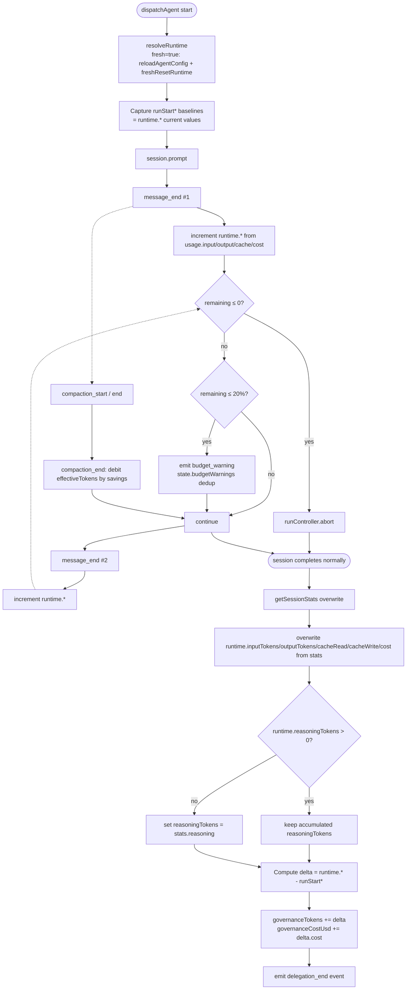
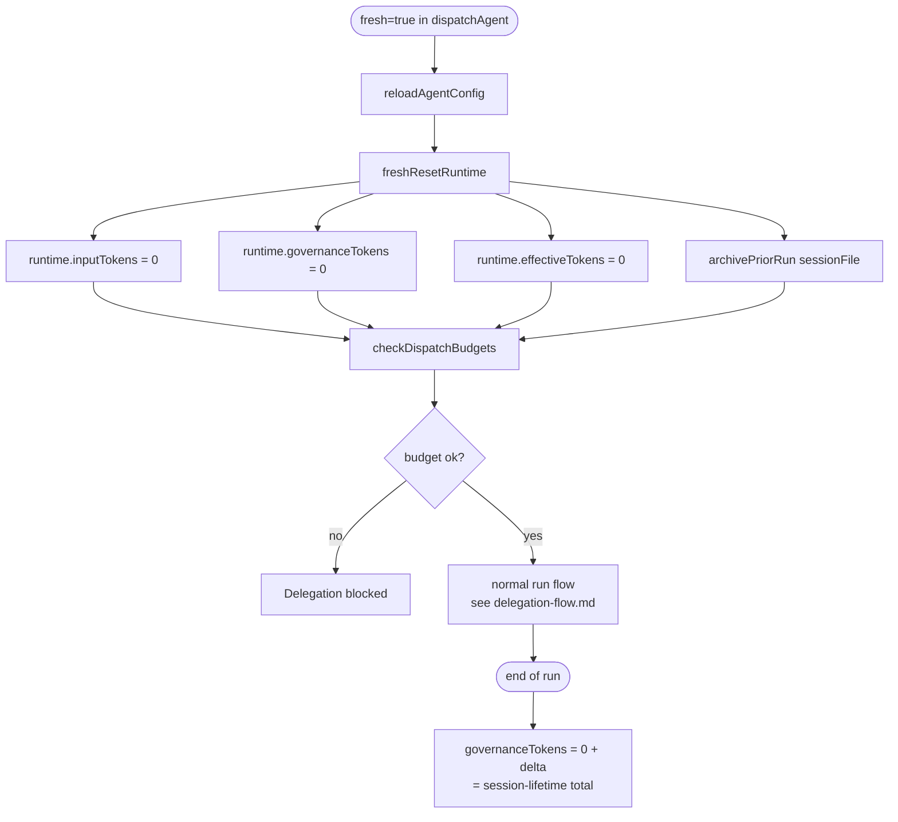
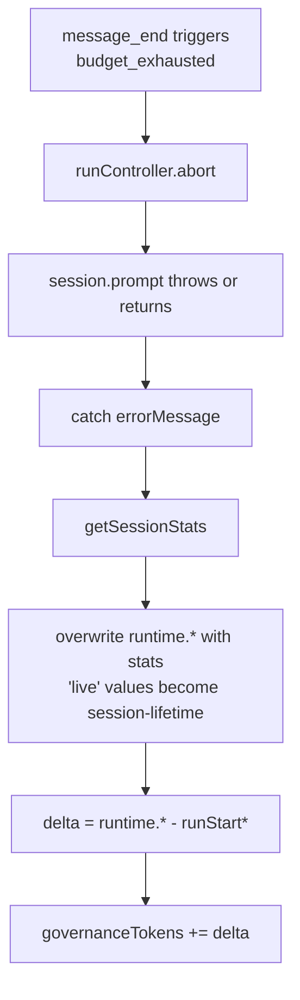

# Current flow — accumulation

How tokens and cost are accumulated across a worker's lifecycle. The dual- and triple-counter system is the heart of the budget layer's complexity; this file documents every place a counter is read or written.

## Counters on `AgentRuntime`

From `src/core/types.ts:222-273`:

| Field | Type | Source | Lifetime |
|---|---|---|---|
| `inputTokens` | `number` | SDK `usage.input` | session-lifetime; overwritten by `getSessionStats()` at run end |
| `outputTokens` | `number` | SDK `usage.output` | session-lifetime; overwritten |
| `cacheReadTokens` | `number` | SDK `usage.cacheRead` | session-lifetime; overwritten |
| `cacheWriteTokens` | `number` | SDK `usage.cacheWrite` | session-lifetime; overwritten |
| `reasoningTokens` | `number` | SDK `usage.reasoning` | accumulated per-message; preserved (NOT overwritten by stats) |
| `costUsd` | `number` | SDK `usage.cost` | session-lifetime; overwritten |
| `governanceTokens` | `number?` | derived: `sum of per-run deltas` | **monotonic across runs; survives fresh archive** |
| `governanceCostUsd` | `number?` | derived: `sum of per-run cost deltas` | monotonic across runs |
| `effectiveTokens` | `number?` | derived: `runtime.contextTokens`, debited by compaction | current context load |
| `runStartInputTokens` | `number?` | captured at run start from `runtime.inputTokens` | per-run; reset on each dispatch |
| `runStartOutputTokens` | `number?` | same pattern | per-run |
| `runStartCacheReadTokens` | `number?` | same pattern | per-run |
| `runStartCacheWriteTokens` | `number?` | same pattern | per-run |
| `runStartReasoningTokens` | `number?` | same pattern | per-run |
| `runStartCostUsd` | `number?` | same pattern | per-run |

The naming convention is:

- **`runtime.*`** = session-lifetime totals from the SDK (overwritten by `getSessionStats()` at run end).
- **`runtime.governance*`** = monotonic-across-runs cumulative accounting (never decreases; never reset by `freshResetRuntime` unless explicitly zeroed — see Bug 1 fix).
- **`runtime.effective*`** = current context-load tracker (refreshed from `contextTokens`, debited by compaction).
- **`runtime.runStart*`** = lifetime totals captured at the START of the current run, used to compute per-run deltas.

## Flow of one run



## The `workerConsumedTokens` choice

The question "what has this worker consumed right now?" has three candidate answers:

1. **`runtime.*` (live)** — incremented per-message by `message_end`. Reflects everything the worker has done since the start of the current session.
2. **`governanceTokens`** — frozen at `agent_end`. Reflects the cumulative across all prior runs. Monotonic.
3. **`effectiveTokens`** — current context load. Debited by compaction_end. Reflects "what is the worker spending on the team budget RIGHT NOW".

The implementation in `src/engine/governance.ts:34-58` picks:

```ts
export function workerConsumedTokens(runtime: AgentRuntime, scope: TokenScope = "all"): number {
  if (runtime.status === "running") {
    return runtimeTokens(runtime, scope);  // live path (Bug 2 fix)
  }
  return runtime.governanceTokens ?? runtime.effectiveTokens ?? runtimeTokens(runtime, scope);
}
```

- Mid-run: live path (so the budget check sees current spend).
- Post-run: frozen path (so the budget check survives across runs without re-counting each session's transient live values).

The `effectiveTokens ?? runtimeTokens` fallback handles the case where `agent_end` never wrote `governanceTokens` (e.g., process crash). It's a safety net, not the primary path.

## What happens on `fresh=true`



After `freshResetRuntime`, every counter is zero. The new run accumulates; at `agent_end`, `governanceTokens = 0 + delta`. Since `runStart*` was captured AFTER the reset, `delta` is exactly the fresh session's usage — no clamp, no double-count.

This is the path the **W1.1 regression test** pins:

> "fresh re-run resets lifetime counters so the delta is the fresh session's usage, not clamped ~0"

## What happens on mid-run abort



The mid-run abort sequence is where the third mystery lives. The values at each step depend on what `getSessionStats()` reports for an aborted session:

- **If the SDK reports the full session lifetime** (the message that triggered the abort is included), `delta = runtime.* - runStart*` is the FULL session's usage, and `governanceTokens` correctly accumulates.
- **If the SDK reports 0** for an aborted session (the abort cleared internal counters), `runtime.*` is overwritten to 0, `delta = 0 - 0 = 0`, and `governanceTokens += 0` is a no-op. The `governanceTokens` stays at whatever it was before this run.

The second case is what the user observed: `tokens=0` (overwritten) but `governanceTokens=15134` (from the in-memory accumulated counter before the overwrite). Net: the worker is treated as having consumed 15134 tokens despite the display showing 0.

## The fundamental question the design must answer

**"What is the single source of truth for how much a worker has consumed?"**

The current design has THREE:

1. `runtime.*` — SDK-reported session-lifetime totals.
2. `governanceTokens` — monotonic across runs, written at end of each run.
3. `effectiveTokens` — current context load, debited by compaction.

Every consumer has to pick which to read. The picks are encoded in `workerConsumedTokens` and `workerConsumedCost` as `??` fallthroughs and `if (status === "running")` branches. This is the structural source of bugs.

### Alternative designs

The review's refactor options explore:

- **Option B (pi-native-tool):** replace the in-memory counters with `UsageEntry` records written to the session file. The session file becomes the source of truth. `getBranch()` at `session_start` rebuilds the counter from the active branch only.
- **Option C (pure-refactor):** keep the in-memory counters but extract them into a `BudgetLedger` module that owns the dual/triple counter system with explicit, testable transitions. The "consumed" function has a single implementation; consumers call it without knowing about the layers.
- **Option D (strategy-deprecation):** keep the current code but narrow the feature to `default` strategy only (no `compact`, no `summarize_progress`, no operator commands). The bug surface shrinks to just the budget math, which is the simplest of the layers.

See `04-refactor-options.md` for the full trade-off matrix.

## Key observations

1. **Three counters are alive at once: `runtime.*`, `governanceTokens`, `effectiveTokens`.** Each has its own write site and its own read site. The reads are mediated by `workerConsumedTokens`/`workerConsumedCost`, which encode the lifecycle transitions in `if` branches.

2. **`getSessionStats()` overwrites `runtime.inputTokens`, `runtime.outputTokens`, `runtime.cacheReadTokens`, `runtime.cacheWriteTokens`, `runtime.costUsd` to the session-lifetime total.** It deliberately does NOT overwrite `runtime.reasoningTokens` unless the SDK reports a positive value (because reasoning accumulation per-message may be more accurate than the stats field).

3. **`governanceTokens` is the only counter that survives a fresh archive.** `freshResetRuntime` zeros it; the new run's `governanceTokens` is computed from the new run's delta. Across many fresh runs, `governanceTokens` is the cumulative-across-runs total.

4. **`effectiveTokens` is recalculated, not accumulated.** It is set from `runtime.contextTokens` at every `message_end` (when smaller), and debited by `savings` at every `compaction_end`. The "current context load" semantics are explicit.

5. **`runStart*` baselines are captured AFTER `freshResetRuntime`** but BEFORE the session starts. So for a fresh run, baselines = 0; for a non-fresh run, baselines = the prior run's final `runtime.*` values. The delta math always works.

6. **The end-of-run `governanceTokens += delta` accumulation runs unconditionally**, regardless of whether the run aborted. An aborted run accumulates its consumed budget. This is the right semantic (the budget was consumed even if the work was rejected) but it is the source of the "stuck at 15134" mystery when the overwrite races the abort.