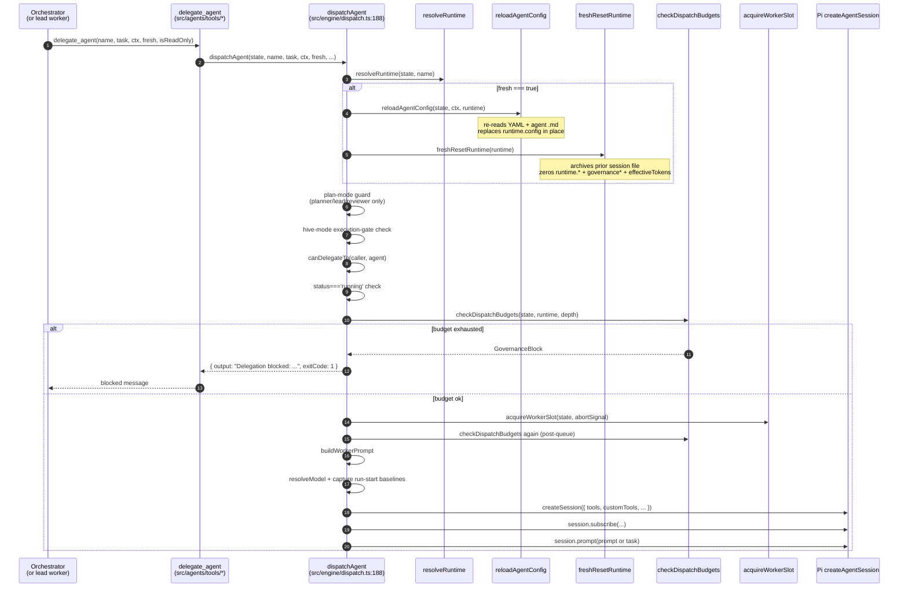

# Current flow — delegation

This file documents what happens between `delegate_agent(...)` invocation and the worker's first model call, focusing on the budget-relevant steps. Every code citation uses the file/line form against `feat/budget-strategy` at `9f950fb`.

## Sequence diagram

## Pre-budget steps (before any budget check)

Every delegation runs through these guards first. The order matters.

### 1. `resolveRuntime` (line 207)

Looks up the named agent in `state.runtimes`. If missing, returns "Unknown agent" with the available roster.

### 2. `reloadAgentConfig` (lines 213-214, only if `fresh`)

When `fresh=true`, the agent's `.md` frontmatter and the team's YAML config are re-read from disk and `runtime.config` is replaced in place. This is so the worker's `domain`, `tools`, `model`, `governance`, and `agentType` reflect any edits the user made since session start.

Without `fresh=true`, `runtime.config` stays frozen at session start.

### 3. `freshResetRuntime` (line 214, only if `fresh`)

Defined at lines 73-110. Three jobs:

1. Archive the prior `<slug>.jsonl` to `<slug>.run-N.jsonl` (best-effort; doesn't crash if the file is missing).
2. Zero every token/cost counter on the runtime:
   - `runtime.inputTokens = 0`
   - `runtime.outputTokens = 0`
   - `runtime.cacheReadTokens = 0`
   - `runtime.cacheWriteTokens = 0`
   - `runtime.reasoningTokens = 0`
   - `runtime.costUsd = 0`
   - `runtime.governanceTokens = 0` (the cumulative cap-tracked counter)
   - `runtime.governanceCostUsd = 0`
   - `runtime.effectiveTokens = 0`
3. Defense-in-depth comment explains the zero: even though `workerConsumedTokens` prefers `governanceTokens`, the `effectiveTokens` reset guards any caller that reads it directly.

### 4. Plan-mode guard (line 226)

If `state.mode === "plan"`, only `agentType` ∈ {`planner`, `lead`, `reviewer`} may be dispatched. Coders and testers are blocked.

### 5. Per-artifact planning stop (line 240)

When in plan mode and delegating to a planner, check whether a previous planner has authored an artifact that is awaiting human review. If so, block unless the current task is an explicit same-artifact revision task.

### 6. Hive-mode execution gate (line 252)

When in hive mode and delegating to a coder or tester, the OpenSpec execution gate must be open (`isExecutionGateOpen`). Otherwise return "Delegation blocked: execution agents require an approved plan."

### 7. `canDelegateTo` (line 262)

Type-policy check: can the caller delegate to the target? Rejects based on `allowedAgents`, the typed-specialist widening rule, and `isReadOnly`.

### 8. Running-status check (line 268)

If the worker's runtime already has `status === "running"`, return early. This prevents double-delegation to a worker that's mid-task.

## Budget check

### 9. `checkDispatchBudgets` (line 252)

Defined in `src/engine/governance.ts:73-104`. Eight sequential checks (worker first, then team):

1. `maxDelegationDepth` (worker)
2. `maxRuns` (worker)
3. `tokenBudget` (worker)
4. `costBudgetUsd` (worker)
5. `maxRuns` (team)
6. `tokenBudget` (team)
7. `costBudgetUsd` (team)

If any returns `GovernanceBlock`, the function returns that block. The dispatcher emits a `budget_exhausted` event and returns `"Delegation blocked: <message>"` to the caller.

### 10. Worker slot acquisition (line 277-293)

`acquireWorkerSlot` (in `governance.ts:106-138`):

- If `maxParallel` is unset or `activeRuns < maxParallel`: increment `activeRuns` and return `"acquired"`.
- If at cap and `queueSize` is unset: return `"parallel"` immediately.
- If at cap and `queueSize` is set: enqueue and return a promise that resolves to `"acquired"`, `"cancelled"`, or stays pending.

### 11. **Second `checkDispatchBudgets`** (line 302)

After acquiring a slot (potentially after waiting in the queue), the budget is checked again. A queued request can become stale: another request may have started the same worker or consumed its remaining budget while this one waited.

### 12. Prompt assembly and session creation (lines 312-393)

`buildWorkerPrompt`, `resolveModel`, `createAgentSession` — all wired through normal Pi SDK extension entry points. Note: this is where `runtime.governanceTokens ??= <initial value>` (line ~316) runs. The `??=` is significant: it sets `governanceTokens` ONLY IF UNDEFINED. After `freshResetRuntime` zeroed it, it stays zero; on a non-fresh dispatch it picks up the prior value.

### 13. Event subscription (lines 401-690)

`session.subscribe((event) => ...)` is the hot path. Every `message_end`, `compaction_end`, `tool_execution_*`, `agent_end` event flows through here. See `accumulation-flow.md` for the event-by-event budget treatment.

### 14. Run-state mutation (lines 363-378)

`runtime.status = "running"`, `runtime.runCount++`, `runtime.startedAt = Date.now()`, and the run-start baselines (`runStartInputTokens = runtime.inputTokens` etc.) are captured HERE — after `freshResetRuntime` has zeroed the counters, so the baselines are 0 for a fresh dispatch.

### 15. Session prompt (lines 727-758)

`runAtDelegationDepth(delegationDepth, () => runAsAgent(runtime.config.name, () => runWithChange(scopedChangeId, () => session.prompt(...))))`. The actual model call.

The `runAsAgent` and `runWithChange` AsyncLocalStorage scopes ensure nested `delegate_agent` calls inside the worker inherit the right caller name and change id.

## Key observations

1. **The fresh-reset is the first thing that happens after the `resolveRuntime` lookup.** Lines 213-214 place it before every guard, before the plan-mode check, before the budget check. This is the fix from Bug 1 (commit `081380a` / refined in `3be33f6`). Before the fix, the reset was at line ~318 and the budget check at line ~252, so an exhausted worker could never be respawned.

2. **There is no path that skips `freshResetRuntime` for a `fresh=true` dispatch.** The two are linked by `if (fresh) { reloadAgentConfig; freshResetRuntime }`. This is structurally correct, but the two side effects are interleaved with the rest of dispatch in a way that makes the sequence hard to reason about (see `fresh-true-bug-timeline.md`).

3. **`reloadAgentConfig` and `freshResetRuntime` are both unconditional inside the `if (fresh)` block.** If either throws (YAML re-parse failure, rename error, permission error on the archive), the whole dispatch aborts. There is no recovery path.

4. **The "double budget check" at line 252 and line 302 is intentional but fragile.** The intent is correct (queue may invalidate the budget), but the second check happens AFTER the slot is acquired, so on a budget block it has to release the slot. A simpler design would check the budget once after slot acquisition. The redundancy is a bug-shaped hazard (see `refactor-options/`).

5. **`runtime.governanceTokens ??= <initial value>` on line ~316 is the only place the initial governance value is set.** If `freshResetRuntime` was skipped (e.g., `fresh=false` but the runtime is in a fresh state because the process restarted), `governanceTokens` stays undefined and falls through to `effectiveTokens ?? runtimeTokens(...)` in `workerConsumedTokens`. This is the dual-counter system; see `accumulation-flow.md`.

6. **The `sessionFileExisted` flag (line ~320) is captured BEFORE the archive.** It is then used to decide whether to pass the full assembled worker prompt or just the lean task to `session.prompt()` — see the comment at lines ~734-748. This is a separate concern from budget, but it sits in the same code block.